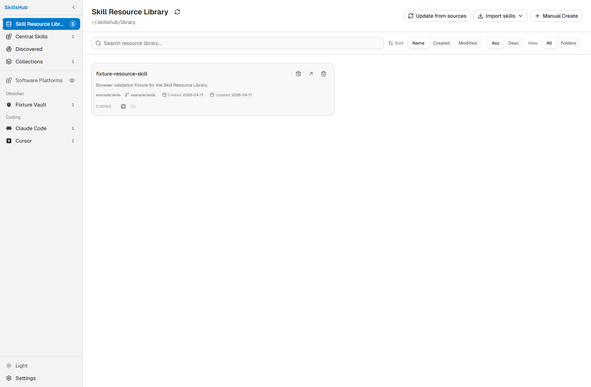
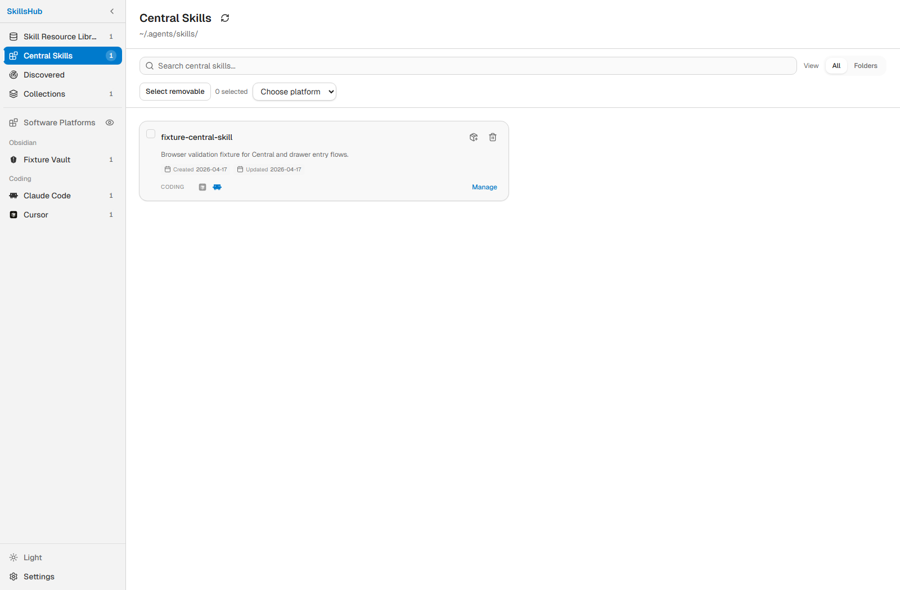
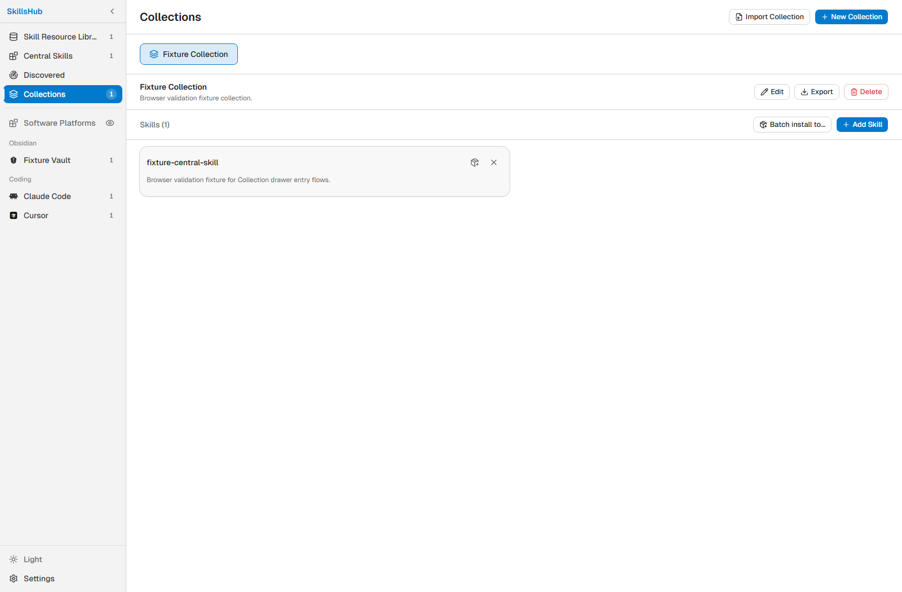
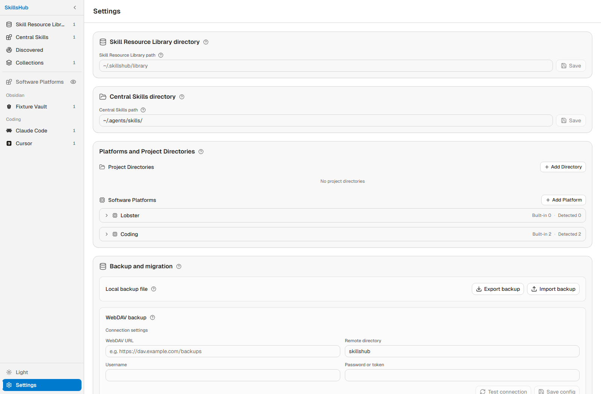
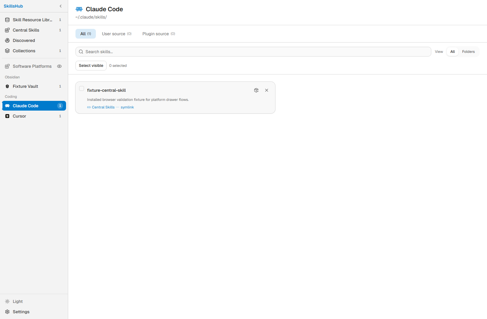
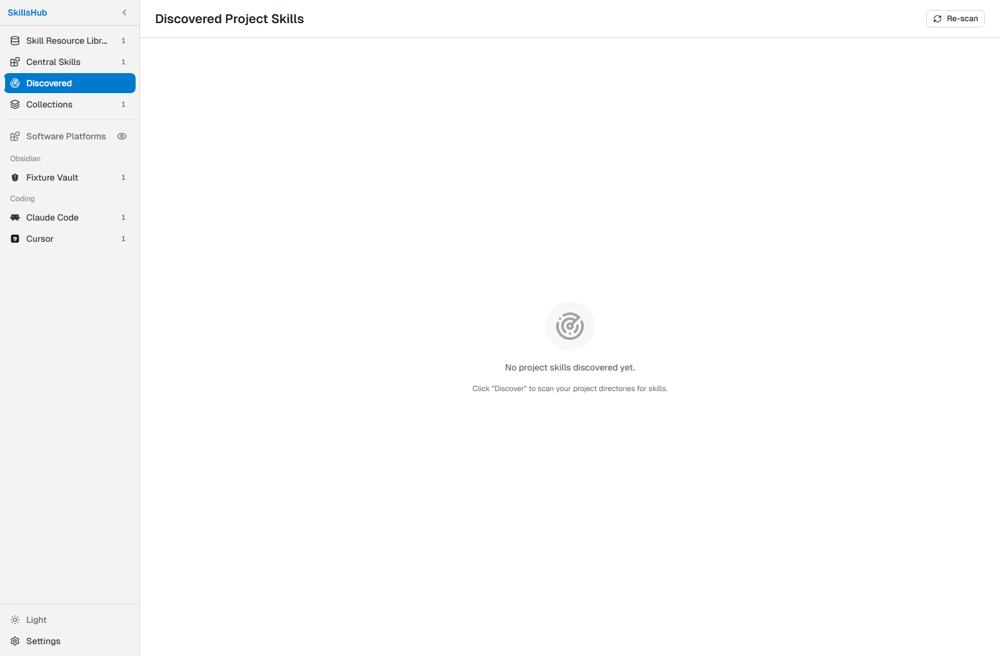

# SkillsHub

SkillsHub is a local-first desktop app for collecting, reviewing, and installing AI agent skills across multiple coding tools.

[中文文档](README_CN.md)

> **Disclaimer**
>
> SkillsHub is an independent, unofficial application. It is not affiliated with, endorsed by, or sponsored by Anthropic, OpenAI, GitHub, skills.sh, MiniMax, or any other supported platform, publisher, or trademark owner.

## What It Does

SkillsHub keeps skill storage and platform installation separate:

- **Skill Resource Library** is the default place for imported, downloaded, and manually created skills. GitHub repositories and supported skills.sh links import here first.
- **Central Skills** is the compatibility library, usually `~/.agents/skills/`, for skills you intentionally promote into the shared central directory.
- **Software Platforms** are the concrete tool-specific skills folders, such as Claude Code, Codex CLI, Cursor, Gemini CLI, OpenClaw, and similar tools.
- **Collections** let you group central skills and install them as reusable sets.
- **Discovered Skills** scans configured project directories for skills that are not yet managed by SkillsHub.

Application data is stored in `~/.skillshub/db.sqlite`. On first launch after upgrading from older releases, SkillsHub can migrate an existing `~/.skillsmanage/db.sqlite` database when the new database does not exist yet.

## Highlights

- Resource-library-first workflow for GitHub imports, supported skills.sh imports, and manual skill creation.
- A single **Import Skills** menu that supports GitHub repository import and skills.sh skill link import.
- GitHub repository preview before import, with conflict handling for rename, overwrite, or skip.
- Source metadata tracking for imported skills, plus one-click source updates when a skill can be traced back to its origin.
- Resource Library source updates can recover missing GitHub raw URLs from saved repository/path metadata before updating local files.
- Resource Library folder view grouped by source-style paths such as `owner/repo`, matching common local layouts like `author/project/skill`.
- Skill cards show created and updated dates separately with labels that match the current UI language.
- Direct installation from the Resource Library to selected platforms without forcing the skill into Central Skills.
- One-click promotion from the Resource Library to Central Skills, with automatic synchronization to every detected local platform when Central Skills already contains managed skills.
- Central Skills management with folder view, safe deletion previews, platform install status, and batch uninstall from selected platforms.
- Full skill detail page with Markdown preview, raw source view, grouped notes, tags, source information, time information, storage paths, installation status, and collections.
- Editable source metadata fields for manually maintained records, including source type, repository, author, source path, and source URL.
- Software platform management in Settings, including editable built-in platforms, custom platforms, Lobster/Coding grouping, two-column compact layout, built-in/detected group counts, and visual distinction for detected local skills directories.
- Local ZIP backup and WebDAV backup/import, including connection testing, remote backup listing, upload, selected import, and selected delete. Backup files exclude API keys, tokens, and password-like values.
- Update checking from the About section.
- Bilingual UI, system/light/dark theme mode from the lower-left sidebar, unified selected-state colors across sidebar/provider/language controls, and a simplified top area without a global search box.

## Screenshots

English screenshots are generated from the English UI. Chinese screenshots are kept in [README_CN.md](README_CN.md).

### Skill Resource Library



### Central Skills



### Collections



### Settings, Platforms, And Backup



### Platform Skills



### Discovered Skills



## Skill Storage Model

SkillsHub uses three different storage concepts:

| Area | Purpose | Typical Path |
|------|---------|--------------|
| Skill Resource Library | Long-term local storage for imported or manually created skills | `~/.skillshub/library` |
| Central Skills | Shared compatibility directory for intentionally promoted skills | `~/.agents/skills` |
| Platform directory | Tool-specific install target created as a symlink or copy | Depends on platform |

Installing a skill directly from the Resource Library writes only to the selected platform. Promoting a skill to Central Skills writes to the central directory. When Central Skills already contains managed skills, newly detected local platforms are automatically included in central synchronization and shown in the sidebar.

Changing the Resource Library path or Central Skills path does not automatically rewrite existing platform symlinks or copies. Reinstall affected skills if you intentionally move those directories.

## Supported Platforms

Built-in platform definitions can be edited or removed from Settings. They are stored in local app configuration when changed, so the customizations survive restart.

| Category | Examples |
|----------|----------|
| Coding | Claude Code, Codex CLI, Cursor, Gemini CLI, GitHub Copilot, Kiro CLI, Warp, Windsurf, Trae, Aider, OpenCode, Continue, Qwen, and other coding agents |
| Lobster | OpenClaw, AutoClaw, EasyClaw, QClaw, WorkBuddy, and related Lobster-style platforms |
| Custom | Any local platform with a stable skills directory |

In the sidebar, built-in platforms are shown only when their configured skills directory exists locally, unless you explicitly choose to show all platforms. Settings group headers show both the total built-in platform count and the number detected on the current machine.

## Importing Skills

The Resource Library has a single import menu:

- **Import from GitHub** accepts a repository URL, previews discovered `SKILL.md` files, and imports selected skills into the Resource Library.
- **Import from skills.sh** accepts a supported skills.sh skill URL and resolves the GitHub-backed source before importing into the Resource Library.

GitHub Personal Access Tokens can be configured in Settings for authenticated GitHub requests. Tokens are used only for direct GitHub domains and are not written into backup files.

## Backup And Migration

SkillsHub can export and import complete local backup files. WebDAV backup support adds connection testing, remote backup listing, upload, selected-remote restore, and selected-remote delete workflows.

Backups include skills, source metadata, collections, custom platform settings, regular app settings, and platform installation state. API keys, tokens, and passwords are intentionally excluded and must be re-entered after restore.

## Privacy And Security

- SkillsHub is local-first and does not include telemetry.
- Network requests happen only when you use network-backed features such as GitHub import, skills.sh import resolution, source updates, WebDAV backup, update checking, or AI-generated notes.
- Credentials are stored locally when you choose to save them. The app does not encrypt local settings at rest.
- Do not share real tokens, API keys, private paths, or sensitive screenshots in issues, pull requests, or logs.

## Development

### Requirements

- Node.js LTS
- pnpm
- Rust stable toolchain
- Tauri v2 system dependencies: <https://v2.tauri.app/start/prerequisites/>

### Commands

```bash
pnpm install
pnpm tauri dev
pnpm build
pnpm test
pnpm typecheck
pnpm lint
cd src-tauri && cargo test
cd src-tauri && cargo clippy -- -D warnings
```

The Vite development server uses port `24200`.

## Release

GitHub Actions publishes desktop packages when a version tag such as `v0.15.0` is pushed. The release workflow reads release notes from `CHANGELOG.md`, so every release version must have a matching changelog section.

Local packaging scripts are still available for host-specific builds:

| Platform | Command |
|----------|---------|
| Windows | `pnpm package:release:windows -- -Version 0.15.0` |
| macOS | `pnpm package:release:macos -- -Version 0.15.0` |
| Linux | `pnpm package:release:linux -- -Version 0.15.0` |

Use `-VersionOnly` when you only need to update version metadata before committing a release.

## Project Structure

```text
skillshub/
├── src/                 # React frontend
├── src-tauri/           # Rust/Tauri backend
├── images/              # Chinese README screenshots
├── images/en/           # English README screenshots
├── scripts/             # Release packaging scripts
├── CHANGELOG.md         # English changelog
└── CHANGELOG.zh.md      # Chinese changelog
```

## License

Apache License 2.0. See [LICENSE](LICENSE).
