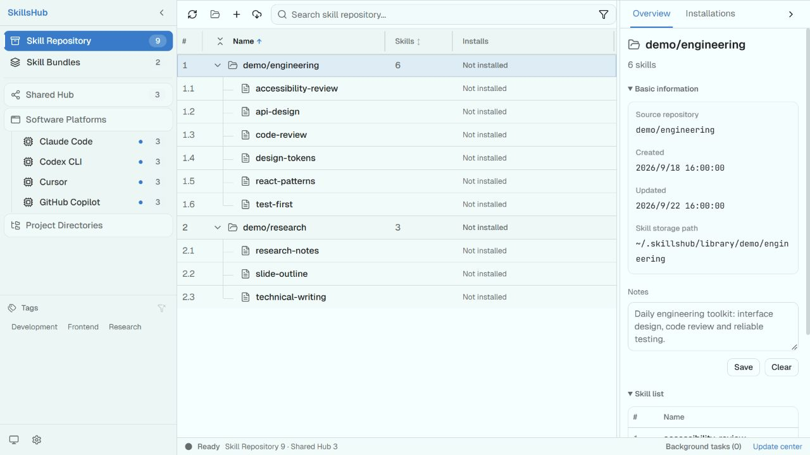
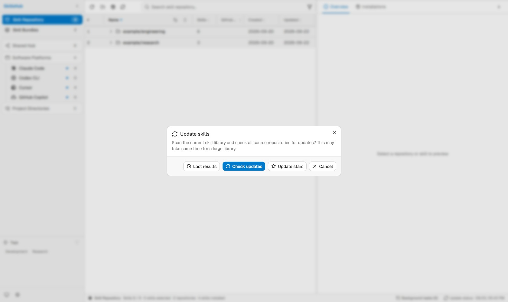
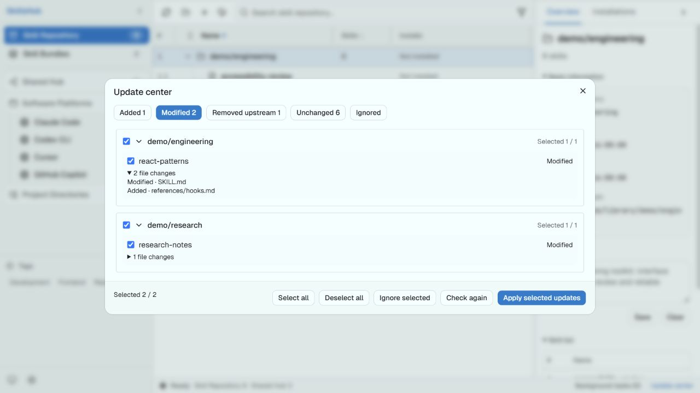
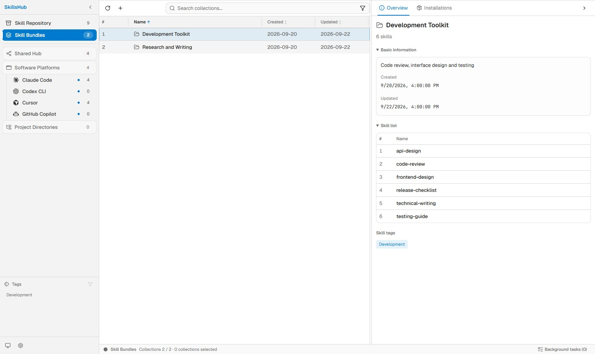
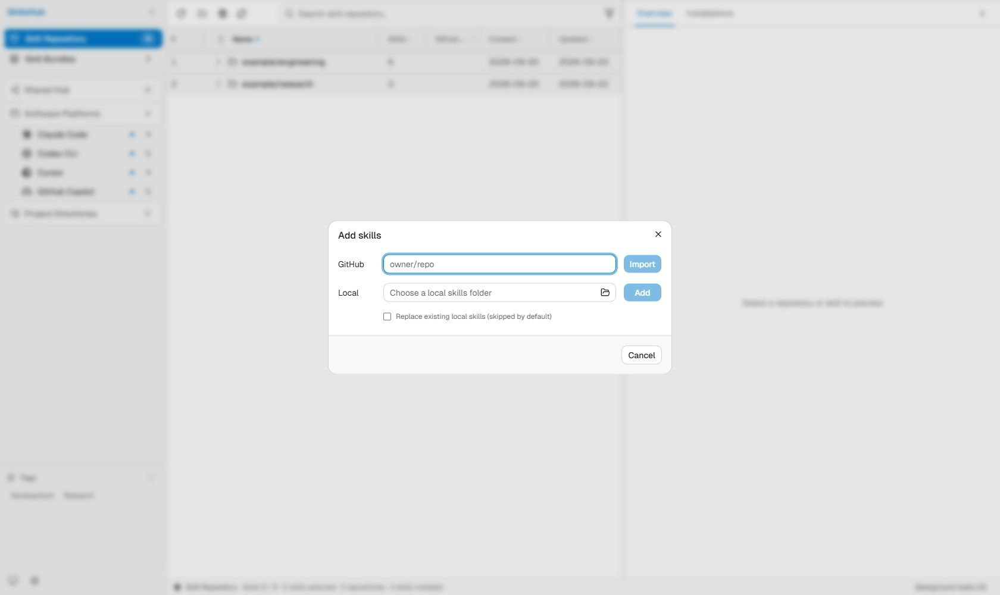

<div align="center">

[简体中文](README_CN.md) · [English](README.md)

# SkillsHub

### One skill library. Your AI tools and projects, connected.

Import, organize, update and distribute `SKILL.md` skills to Claude Code, Codex CLI, Cursor and other tools from one desktop app.

[](https://github.com/yufenglyu/skillshub/releases)
[](LICENSE)


[Download](https://github.com/yufenglyu/skillshub/releases) · [Get started](#get-started) · [Changelog](CHANGELOG.md) · [Report an issue](https://github.com/yufenglyu/skillshub/issues)

</div>



*Screenshots show the UI from the current v1.1.1 source, using fictional repositories, skills and paths. The example content is not bundled with the app.*

## Why SkillsHub?

Skills end up scattered across tool folders. Starting a new project means copying them again. As your collection grows, keeping track of what each skill does, where it is installed and whether it has changed becomes its own task. SkillsHub brings that work into one place.

| What you need | How SkillsHub helps |
| --- | --- |
| Use a skill across multiple AI tools | Keep it in one repository, install by platform or project, and add everyday skills to Shared Hub. |
| Keep up with upstream changes | Review added, modified and removed skills, inspect file changes, then apply selected updates. |
| Find useful skills in a growing library | Combine tags, search names, descriptions and notes, and assign tags with drag and drop. |
| Prepare a toolkit for each workflow | Build bundles for development, research or writing and install them to multiple targets. |
| Understand skills and record your judgment | Read their documents, write notes, or edit AI-generated notes and tags before saving. |
| Keep your library across devices | Use local files, ZIP backups, WebDAV repository sync and portable mode. |

## Collect once, use across tools

**The Skill Repository is the primary store; you choose where each skill is used.** Import from GitHub or a local folder, then install to a platform, a project, or Shared Hub.

```text
GitHub / Local folders
        ↓
  Skill Repository ── Skill Bundles: organize by workflow
        ├── Software platforms: tool-specific skill directories
        ├── Project directories: <project>/.agents/skills
        └── Shared Hub: ~/.agents/skills
```

- **Shared Hub** links back to repository skills. Removing a skill from the hub removes the link and keeps the original files. Whether a tool can use the shared directory depends on its own support and configuration.
- **Software platforms** support custom names and skill paths. Right-click in the sidebar to add, edit, disable or remove them. Missing directories automatically disable the corresponding platform; disabled platforms are hidden from the sidebar.
- **Project directories** keep skill choices scoped to individual projects and can be managed from sidebar context menus.
- **Visible installation relationships** show where skills are used and distinguish Shared Hub from independent installations. Platform installation prefers links and falls back to copying when needed.

## Know what changes before you update

The **Update skills** dialog offers **Last results / Check updates / Update stars / Cancel**. Checks start only after confirmation. Updating stars fetches repository statistics without downloading skills or replacing the last update report.



The status bar shows Update status with a check timestamp. Open the results to collapse repositories, filter by status and inspect changed files.



- Select individual skills or entire groups. Upstream deletions are not selected by default.
- Ignore a detected version; a later upstream change makes it eligible for review again.
- Recheck selected repositories from the footer without losing other results. Retry failures checks selected failed repositories, or all currently visible failures if none are selected.
- Review replacements under remote deletions and select them and use Delete & reimport in the footer; ambiguous matches require manual pairing.
- Resize the dialog as needed; filtering keeps its height unchanged.
- Imports, update checks, applied updates and AI generation run through a background queue with progress, results, manual stop, retries and manual cleanup. Running tasks stop after the current step finishes.
- Navigating away or closing a dialog does not interrupt a task. Tasks run while the app is open; interrupted tasks can be retried after restarting.

## Build your own skill toolkit

**Tags help you find skills; bundles help you reuse them.** Label skills by purpose, group the ones you use together, and install a bundle when starting a project.



- Click a tag to filter, then click it again to clear. Use `Ctrl / Cmd` to select multiple tags and match their intersection.
- Drag selected skills onto a tag to add it. Hold `Shift` while dropping to remove only that tag.
- The filter button inside the search field lets you search repository names, skill names, descriptions and notes. Repository folders can have their own notes. The filter closes on focus loss, an outside click or Escape.
- The detail pane provides overview, documents and installation information. Tables support sorting, column visibility, reordering and resizing. Switch between `owner/repository` and `repository@owner` from the right of the name header; name sorting follows the displayed format.
- Skill notes and tags use **AI / Save / Clear** controls. Each AI request produces an editable suggestion. Tag suggestions are appended and deduplicated, preserving existing tags; changes are written only when saved. Configure your own AI service and prompts.

## Get started

1. Download an installer or portable archive for your system from [Releases](https://github.com/yufenglyu/skillshub/releases), then launch SkillsHub.
2. Check platform directories in Settings, or add your own platforms and projects from the sidebar.
3. In Skill Repository, choose **Add skills** and enter a GitHub `owner/repo`, repository URL, or local skill folder.
4. Read the skill, add tags or notes, organize it into a bundle, then install it to the platforms, projects or Shared Hub you need.
5. Use **Update skills** to review upstream changes and **Background tasks** to follow execution.

The toolbar uses distinct icons: a package with a plus for adding skills, two circular arrows for updating, and a single rotating arrow for refreshing the list. Hover for labels. GitHub imports only flag overwrites at the actual destination; matching IDs in different repositories remain independent.



## Your data and backups

Local and WebDAV repository backups preserve cached GitHub star counts and their timestamps. Directory CSV exports also include star counts.

Skills stay on your machine. The default repository is `~/.skillshub/library`; portable mode keeps `.skillshub` next to the executable so the application and its data can travel together.

| Option | Purpose |
| --- | --- |
| Local ZIP backup | Export and restore data according to the selected backup scope. |
| WebDAV repository sync | Transfer repository content and bundles, using the receiving device's paths and preserving its settings and installation targets. |
| Bundle import / export | Reuse a collection of skills. |

GitHub import and updates, WebDAV, and optional AI features connect to their respective services. AI generation sends the relevant skill content to your configured provider. Treat the configuration directory as private local data; backups exclude API keys, tokens and passwords.

## Download and development

See [Releases](https://github.com/yufenglyu/skillshub/releases) for the artifacts actually available for each release. The repository includes Windows, macOS and Linux packaging scripts; Windows packaging produces an MSI and a portable ZIP.

Development requires Node.js, pnpm, Rust and the system dependencies for Tauri v2.

```bash
pnpm install
pnpm tauri dev       # Full desktop application
pnpm dev             # Browser frontend preview
pnpm build           # Type checking and frontend build
pnpm test
pnpm lint
cd src-tauri && cargo test
```

Packaging commands: `pnpm package:release:windows`, `pnpm package:release:macos`, `pnpm package:release:linux`. Distribution artifacts are written to `release-assets/`.

Built with **Tauri 2 · Rust · SQLite · React · TypeScript**. The interface supports English, Simplified Chinese, light/dark themes and configurable accent colors.

## Contributing and license

Issues and focused improvements are welcome. Include your version, operating system and reproduction steps, and use screenshots without private information.

SkillsHub is an independent, unofficial project and is not affiliated with or endorsed by the vendors of supported tools.

[Apache License 2.0](LICENSE)
