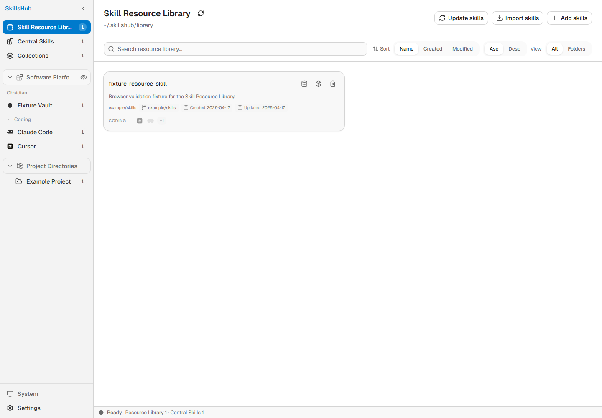
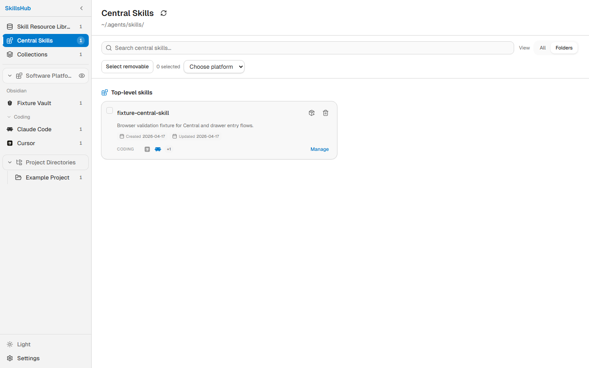
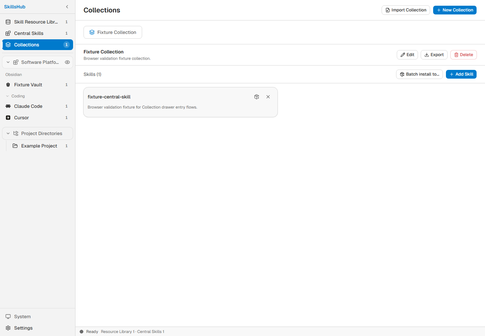
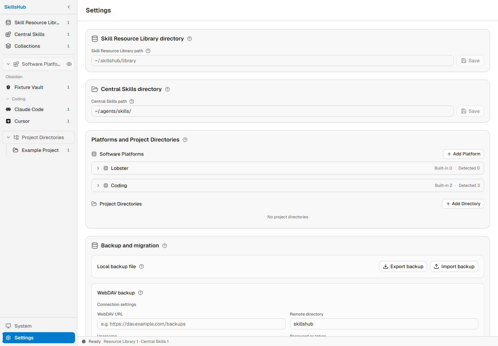
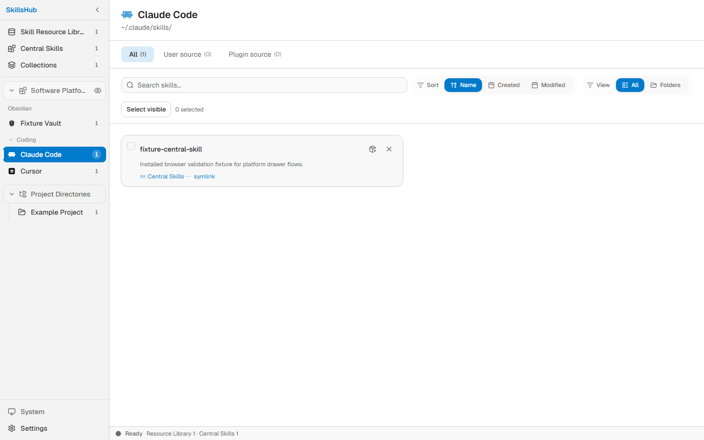
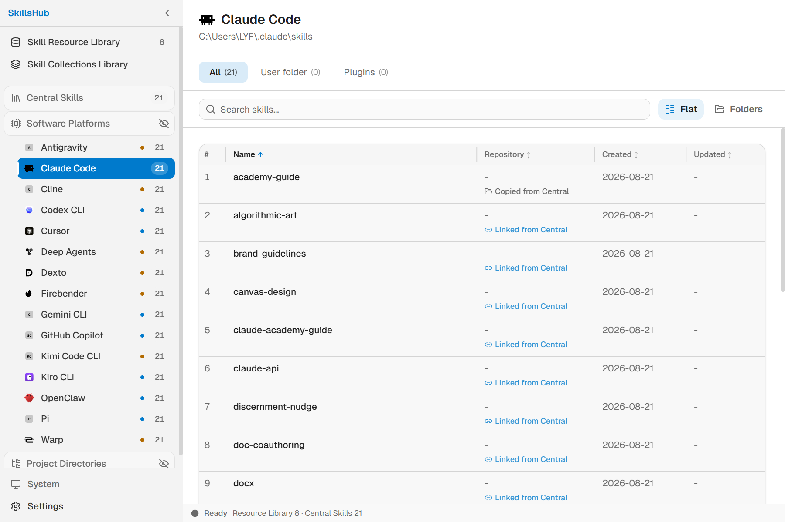

# SkillsHub

SkillsHub is a local-first desktop app for collecting, reviewing, and installing AI agent skills across coding tools and project directories.

[中文文档](README_CN.md)

> **Disclaimer**
>
> SkillsHub is an independent, unofficial application. It is not affiliated with, endorsed by, or sponsored by Anthropic, OpenAI, GitHub, skills.sh, MiniMax, or any other supported platform, publisher, or trademark owner.

## What It Does

SkillsHub keeps long-term skill storage separate from where tools actually load skills:

| Area | Role | Typical path |
|------|------|--------------|
| **Skill Resource Library** | Default home for imported and locally added skills | `~/.skillshub/library` |
| **Central Skills** | Shared compatibility library you promote into on purpose | `~/.agents/skills` |
| **Software platforms** | Tool-specific install targets (symlink or copy) | Depends on the tool |
| **Project directories** | Named project-scoped install targets | `<project>/.agents/skills` |
| **Collections** | Reusable groups of Resource Library skills | App database |

Application data lives in a `.skillshub` folder (`~/.skillshub` by default). Put `.skillshub` next to `skillshub.exe` for a portable install, or choose another config folder in Settings. After upgrading from older releases, SkillsHub can migrate `~/.skillsmanage` on first launch when the new folder does not exist yet.

## Highlights

- **Table-first browsing** in the Resource Library, Central Skills, software platforms, and project directories. Search, sort, and the flat/folder switch sit on one toolbar, with the view switch next to the search box.
- **Folder view** groups skills by source-style paths such as `owner/repo`. Resource Library folders can be promoted to Central Skills or installed into platforms and projects; platform and project folders can be uninstalled as a unit.
- **Clear install stats** on every table: direct installs split into platforms and projects, plus shared availability. Hover a cell to see the target names.
- **Consistent actions**: add/remove Central Skills, install/uninstall to a platform or project, update, and delete. Tooltips stay short and do not include skill names.
- **Import Skills** runs an isolated `npx skills add owner/repo` download, then copies complete skill folders into the Resource Library. An optional skill name imports one skill from a multi-skill repository.
- **Add Skills** copies a prepared local skill or skill-pack folder and marks it as a local addition, separate from source-tracked npx imports.
- **Update Skills** checks the saved repository marker first and only re-downloads when the source changed. The status bar reports live import, update, and install progress.
- Resource Library skills can install directly to selected platforms or projects without being forced into Central Skills.
- Promoting a skill to Central Skills writes it to `~/.agents/skills`. When Central Skills already has managed skills, newly detected platforms and configured project directories are included in central synchronization.
- If a platform or project uses the shared `.agents/skills` path, installing there is treated as **Add to Central Skills**, not as a self-referencing platform install. Already-central skills show as shared through Central Skills.
- Collections stay compact: create, edit, delete, batch-install, add skills, and refresh. Collection browsing is a single flat table.
- Settings cover the config folder (including portable mode), Resource Library and Central Skills paths with Browse and Open, editable built-in platforms, custom platforms, named project directories, local ZIP / WebDAV backup, and update checking. Browse a folder to save it immediately, or paste a path and press Enter. Backups exclude API keys, tokens, and password-like values, and do not copy this computer's library folder paths to another machine.

## Screenshots

English screenshots are taken from the English UI. Chinese screenshots live in [README_CN.md](README_CN.md).

### Skill Resource Library



### Central Skills



### Collections



### Settings, Platforms, And Backup



### Platform Skills



### Project Directories



## How Installation Works

```text
Resource Library ── install ──► selected platforms / project directories
       │
       └── add to Central Skills ──► ~/.agents/skills
                                        │
                                        └── sync to detected platforms
                                            and configured projects
```

- Direct Resource Library installs write only to the targets you select.
- Adding to Central Skills writes the central copy. Shared-root platforms (their skills directory resolves to `~/.agents/skills`) do not get a second copy; they become available through Central Skills.
- Collections store skill references. The picker reads from the Resource Library; installing a collection or a member skill distributes that Resource Library skill to the selected targets.
- Changing a Resource Library, Central Skills, platform, or project path does not rewrite existing symlinks or copies. Reinstall affected skills after you move those directories.

## Supported Platforms

Built-in platform definitions can be edited or removed in Settings. Changes are stored locally and survive restart.

| Category | Examples |
|----------|----------|
| Coding | Claude Code, Codex CLI, Cursor, Gemini CLI, GitHub Copilot, Kiro CLI, Warp, Windsurf, Trae, Aider, OpenCode, Continue, Qwen, and other coding agents |
| Lobster | OpenClaw, AutoClaw, EasyClaw, QClaw, WorkBuddy, and related Lobster-style platforms |
| Custom | Any local platform with a stable skills directory |

The sidebar shows a built-in platform only when its configured skills directory exists locally, unless you choose to show all platforms. Lobster and Coding platform lists are indented under their category headers, like Project Directories. Software platform groups and project directory lists collapse independently. Configured project directories are not treated as custom coding platforms. Obsidian appears under Software Platforms only for official iCloud vaults (`Library/Mobile Documents/iCloud~md~obsidian/Documents`); local or OneDrive vaults stay in Project Directories when you add them there.

## Importing And Adding Skills

- **Import Skills** accepts only a GitHub `owner/repo`. SkillsHub runs `npx skills add owner/repo` in an isolated temporary directory, then copies the downloaded skill folders into the Resource Library.
- **Add Skills** copies an already prepared local folder. The folder can be a single skill or a pack that contains several skills.

Skills imported through `npx skills` keep the source repository, optional skill name, and update marker for later **Update Skills** runs. Local additions have no remote source and are skipped during source updates. Tags, notes, and source metadata survive scans, imports, refreshes, and update checks.

## Backup And Privacy

SkillsHub can export and import complete local backup files. Local export opens a save dialog and writes the ZIP on disk. WebDAV support adds connection testing, remote listing, upload, selected restore, and selected delete. Remote backup times are shown in the local timezone.

Backups include Resource Library and Central Skills files, source metadata, collections, custom platform settings, regular app settings, and installation state. Export packs every skill still present in the Resource Library on disk, including skills that were added to Central Skills. Central Skills is a subset of the Resource Library, so restore writes those files into both libraries. Restore uses this computer's current library folders and does not reuse path settings from another OS. API keys, tokens, and passwords are excluded and must be re-entered after restore.

- SkillsHub is local-first and does not include telemetry.
- Network requests happen only for `npx skills` import/update, WebDAV backup, update checking, or AI-generated notes.
- Saved credentials stay on the machine and are not encrypted at rest.
- Do not share real tokens, API keys, private paths, or sensitive screenshots in issues, pull requests, or logs.

## Development

### Requirements

- Node.js LTS
- pnpm
- Rust stable toolchain
- Tauri v2 system dependencies: <https://v2.tauri.app/start/prerequisites/>

### Commands

```bash
pnpm install
pnpm tauri dev
pnpm build
pnpm test
pnpm typecheck
pnpm lint
cd src-tauri && cargo test
cd src-tauri && cargo clippy -- -D warnings
```

The Vite development server uses port `24200`.

## Release

GitHub Actions publishes desktop packages when a version tag such as `v0.50.2` is pushed. The release workflow reads notes from `CHANGELOG.md`, so every release version must have a matching changelog section.

Local packaging scripts are still available for host-specific builds:

| Platform | Command |
|----------|---------|
| Windows | `pnpm package:release:windows -- -Version 0.50.2` |
| macOS | `pnpm package:release:macos -- -Version 0.50.2` |
| Linux | `pnpm package:release:linux -- -Version 0.50.2` |

Use `-VersionOnly` when you only need to update version metadata before committing a release.

### Build Output Directories

| Path | Produced by | Purpose | Upload to release |
|------|-------------|---------|-------------------|
| `dist/` | Vite | Frontend build copied into the desktop app by Tauri | No |
| `src-tauri/target/` | Cargo/Tauri | Rust build cache, executable, and raw platform bundles | No |
| `release-assets/` | Local packaging scripts and GitHub Actions | Final renamed installer/archive files | Yes |

When packaging locally, use files from `release-assets/`. Treat `dist/` and `src-tauri/target/` as generated build internals unless you are diagnosing a build problem.

## Project Structure

```text
skillshub/
├── src/                 # React frontend
├── src-tauri/           # Rust/Tauri backend
├── dist/                # Generated Vite frontend build used by Tauri
├── src-tauri/target/    # Generated Cargo/Tauri build output
├── release-assets/      # Generated final release installers and archives
├── images/              # Chinese README screenshots
├── images/en/           # English README screenshots
├── scripts/             # Release packaging scripts
├── CHANGELOG.md         # English changelog
└── CHANGELOG.zh.md      # Chinese changelog
```

## License

Apache License 2.0. See [LICENSE](LICENSE).
