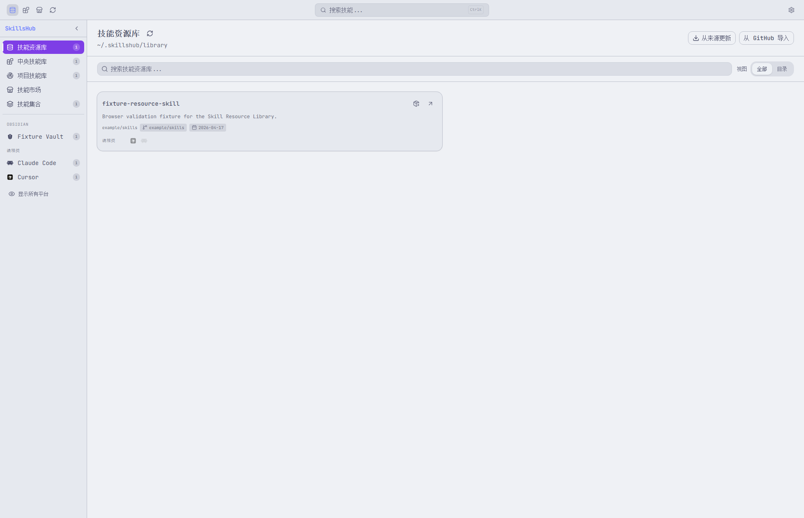
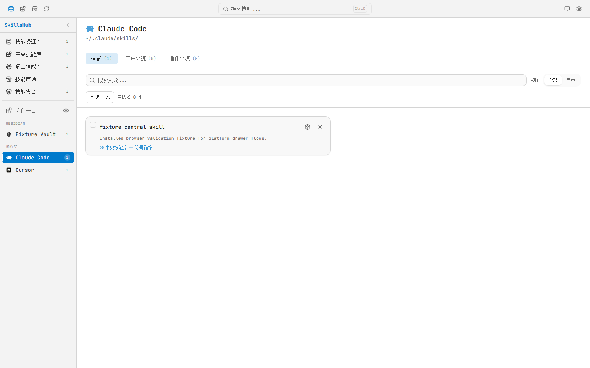
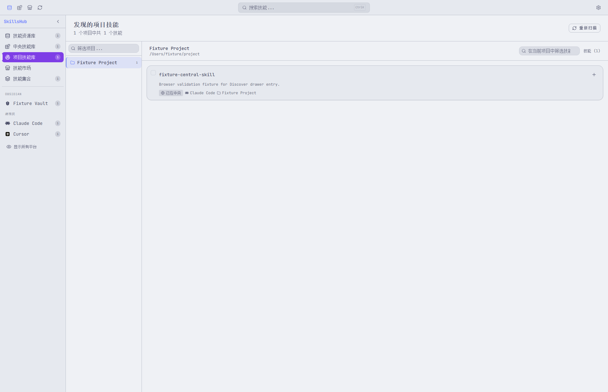
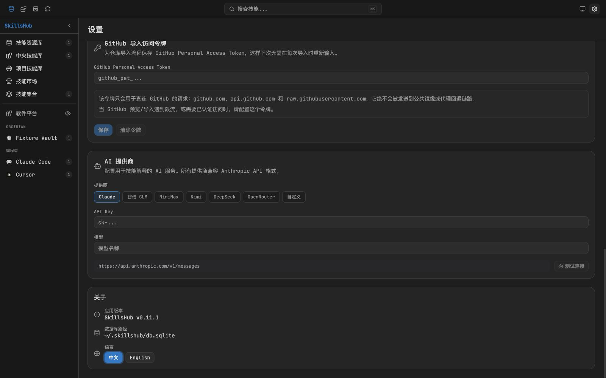
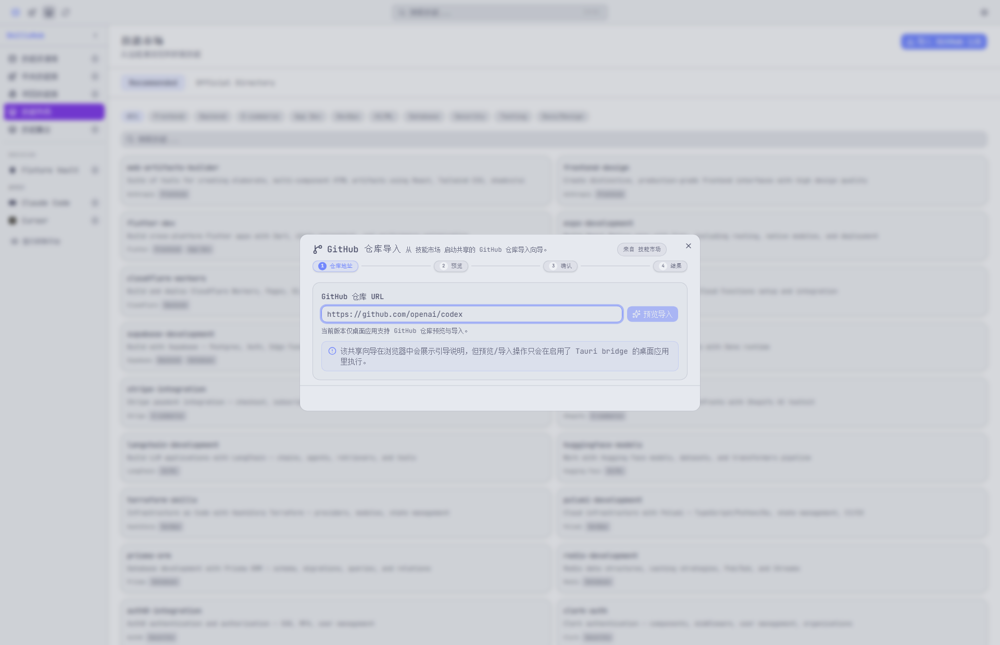
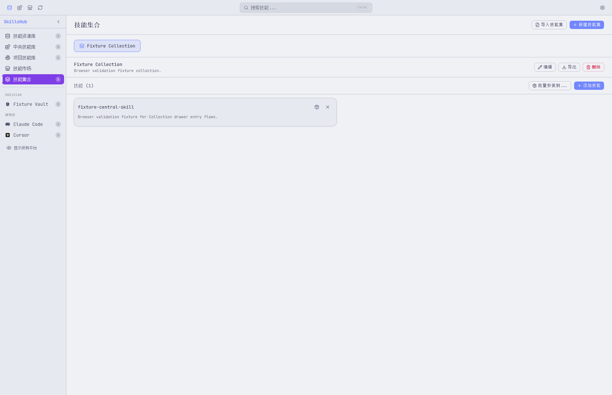

# SkillsHub

SkillsHub 是一个本地优先的 Tauri 桌面应用，用来在技能资源库、中央技能库和多个 AI coding 平台之间管理、同步和安装 agent skills。

[English](README.md)

> **免责声明**
>
> SkillsHub 是一个独立的非官方桌面应用，用于管理本地 skill 目录并导入公开 skill 元数据。它与 Anthropic、OpenAI、GitHub、MiniMax 或其他受支持平台、发布方、商标所有者均无隶属、背书或赞助关系。

## 项目简介

SkillsHub 将长期存储和平台安装拆开处理：

- **技能资源库** 是默认首页，用于保存下载、市场安装、GitHub 导入和带来源信息的 skills。资源库路径可自定义，并会尽量按作者/仓库分组。
- **中央技能库** 通常是 `~/.agents/skills/`，用于兼容支持该目录的平台，也用于把资源库中的技能分发到指定平台。
- **平台视图** 展示每个工具实际可见的 skills，支持单个或批量卸载平台安装，同时保留资源库或中央库中的原始技能。

为兼容旧版本，应用数据仍保存在 `~/.skillsmanage/db.sqlite`。

## 核心能力

- 以技能资源库为默认工作流，GitHub 导入、市场安装和下载默认进入资源库。
- 资源库技能可一键加入中央技能库，并保留 `owner/repo/skill` 这样的来源分组路径，便于区分同名技能。
- 安装到平台时可手动选择目标平台，支持符号链接、复制安装和自动回退。
- 中央技能库支持目录视图、批量从平台卸载、来源更新和安全删除预览。
- 技能详情页支持 Markdown 预览、原始源码、AI 解释、来源、作者/仓库、创建/更新时间、备注和标签。
- 搜索支持名称、描述、备注、标签和来源元信息。
- 标签筛选与技能集合，便于整理和批量安装复用技能。
- GitHub 仓库导入支持预览、重命名/覆盖/跳过冲突处理，并记录来源元数据。
- 技能市场支持源同步、技能下载、按来源更新和单个来源更新。
- 支持导入/导出应用备份，覆盖 skills、元数据、集合、设置以及资源库/中央库布局。
- 支持扫描项目级 skills，包括 Obsidian vault 分组和本地项目 skill 目录。
- 中英文界面、Catppuccin 主题、强调色、响应式导航和紧凑快捷按钮。

## 项目截图

### 技能资源库



### 查看特定平台的已安装技能



### 扫描本地项目技能库



### 浏览技能市场发布者与技能



### 从 GitHub 仓库导入技能



### 管理可复用技能集合



## 下载

- 最新发布：<https://github.com/yufenglyu/skillshub/releases/latest>
- Windows、macOS 和 Linux 安装包可通过 `scripts/package-release.ps1` 构建。
- 如果对应平台还没有发布预编译包，可以从源码运行。

### macOS 未签名构建说明

如果 macOS 提示应用损坏或无法验证，通常是未签名构建被 Gatekeeper 的 quarantine 机制拦截。

把应用移动到 `/Applications` 后，执行：

```bash
xattr -dr com.apple.quarantine "/Applications/SkillsHub.app"
```

然后回到 Finder 再次打开应用。如果你的应用不在 `/Applications`，把命令中的路径替换成实际 `.app` 路径即可。

## 支持的平台

| 类别 | 平台 | Skills 目录 |
|------|------|------------|
| Coding | Claude Code | `~/.claude/skills/` |
| Coding | Codex CLI | `~/.agents/skills/` |
| Coding | Cursor | `~/.cursor/skills/` |
| Coding | Gemini CLI | `~/.gemini/skills/` |
| Coding | Trae | `~/.trae/skills/` |
| Coding | Factory Droid | `~/.factory/skills/` |
| Coding | Junie | `~/.junie/skills/` |
| Coding | Qwen | `~/.qwen/skills/` |
| Coding | Trae CN | `~/.trae-cn/skills/` |
| Coding | Windsurf | `~/.windsurf/skills/` |
| Coding | Qoder | `~/.qoder/skills/` |
| Coding | Augment | `~/.augment/skills/` |
| Coding | OpenCode | `~/.opencode/skills/` |
| Coding | KiloCode | `~/.kilocode/skills/` |
| Coding | OB1 | `~/.ob1/skills/` |
| Coding | Amp | `~/.amp/skills/` |
| Coding | Kiro | `~/.kiro/skills/` |
| Coding | CodeBuddy | `~/.codebuddy/skills/` |
| Coding | Hermes | `~/.hermes/skills/` |
| Coding | Copilot | `~/.copilot/skills/` |
| Coding | Aider | `~/.aider/skills/` |
| Lobster | OpenClaw（开爪） | `~/.openclaw/skills/` |
| Lobster | QClaw（千爪） | `~/.qclaw/skills/` |
| Lobster | EasyClaw（简爪） | `~/.easyclaw/skills/` |
| Lobster | EasyClaw V2 | `~/.easyclaw-20260322-01/skills/` |
| Lobster | AutoClaw | `~/.openclaw-autoclaw/skills/` |
| Lobster | WorkBuddy（打工搭子） | `~/.workbuddy/skills-marketplace/skills/` |
| Central | 中央技能库 | `~/.agents/skills/` |

Claude Code 还可以在平台视图中展示插件和兼容目录中的只读 skills。这些条目只用于查看，不会被普通卸载操作删除。

也可以在设置中添加自定义平台。

## 存储模型

SkillsHub 将三个概念分开：

1. **技能资源库**：长期保存导入或下载的 skills。
2. **中央技能库**：保存需要通过 `~/.agents/skills/` 共享，或需要分发到平台的 skills。
3. **平台目录**：只有当你选择安装到某个平台时，才会创建符号链接或复制安装。

修改技能资源库路径不会移动已有平台安装。修改中央技能库路径会保留旧数据库和设置，但已有平台链接可能需要重新安装。

## 隐私与安全

- **本地优先**：元数据、集合、扫描结果、设置和 AI explanation 缓存都保存在 `~/.skillsmanage/db.sqlite` 或你自己管理的本地 skill 目录中。
- **无遥测**：应用不包含分析、崩溃上报或使用追踪。
- **网络访问由功能触发**：只有在你使用市场同步/下载、GitHub 导入、来源更新或 AI explanation 时才会发起外部请求。
- **凭据仅本地存储**：GitHub PAT 和 AI API key 会保存在本地 SQLite settings 表中，应用本身不提供静态加密。
- 不要在 issue、PR、截图或日志里公开真实密钥。

## 技术栈

| 层 | 技术 |
|----|------|
| 桌面框架 | Tauri v2 |
| 前端 | React 18、TypeScript、Tailwind CSS 4 |
| UI 组件 | shadcn/ui、Lucide icons |
| 状态管理 | Zustand |
| Markdown | react-markdown |
| 国际化 | react-i18next、i18next-browser-languagedetector |
| 主题 | Catppuccin 调色板 |
| 后端 | Rust、serde、sqlx、chrono、uuid |
| 数据库 | SQLite via sqlx（WAL 模式） |
| 路由 | react-router-dom v7 |

## 开发

### 前置依赖

- [Node.js](https://nodejs.org/) LTS
- [pnpm](https://pnpm.io/)
- [Rust toolchain](https://rustup.rs/) stable
- Tauri v2 系统依赖：<https://v2.tauri.app/start/prerequisites/>

### 安装依赖

```bash
pnpm install
```

### 启动开发环境

```bash
pnpm tauri dev
```

Vite 开发服务器默认使用 `24200` 端口。

### 验证命令

```bash
pnpm test
pnpm typecheck
pnpm lint
cd src-tauri && cargo test
cd src-tauri && cargo clippy -- -D warnings
```

### 打包发布

```powershell
powershell -ExecutionPolicy Bypass -File scripts\package-release.ps1 -Version 0.10.6
```

脚本会更新版本元数据，默认执行 TypeScript 与 Rust 编译检查，按当前平台构建 Tauri 安装包，并把产物写入 `release-assets/`。

## 项目结构

```text
skillshub/
├── src/                        # React 前端
│   ├── components/             # UI 组件
│   ├── i18n/                   # 语言文件和 i18n 配置
│   ├── lib/                    # 前端工具函数
│   ├── pages/                  # 路由页面
│   ├── stores/                 # Zustand stores
│   ├── test/                   # Vitest + RTL 测试
│   └── types/                  # 共享 TypeScript 类型
├── src-tauri/                  # Rust 后端
│   └── src/
│       ├── commands/           # Tauri IPC 处理器
│       ├── db.rs               # SQLite schema、迁移、查询
│       ├── lib.rs              # Tauri 应用初始化
│       └── main.rs             # 桌面入口
├── public/                     # 静态资源
├── CHANGELOG.md                # 英文更新日志
├── CHANGELOG.zh.md             # 中文更新日志
└── release-notes/              # GitHub release notes
```

## 数据库

SQLite 数据库仍位于 `~/.skillsmanage/db.sqlite`，用于兼容旧版本安装。

## 更新日志

- 英文：[CHANGELOG.md](CHANGELOG.md)
- 中文：[CHANGELOG.zh.md](CHANGELOG.zh.md)

## 参与贡献

开发环境、验证命令和 PR 约定见 [CONTRIBUTING.md](CONTRIBUTING.md)。

## 安全报告

漏洞反馈和数据处理说明见 [SECURITY.md](SECURITY.md)。

## 许可证

本项目使用 Apache License 2.0，详见 [LICENSE](LICENSE)。
