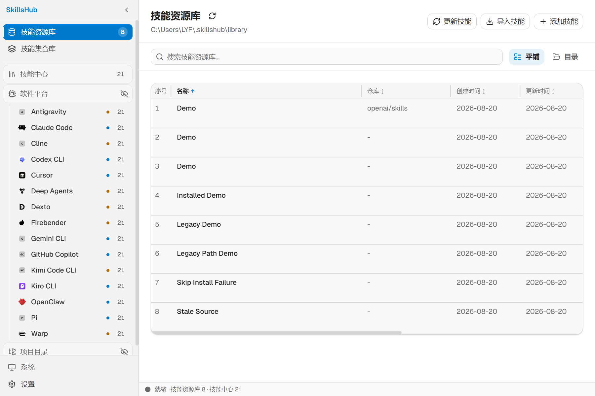
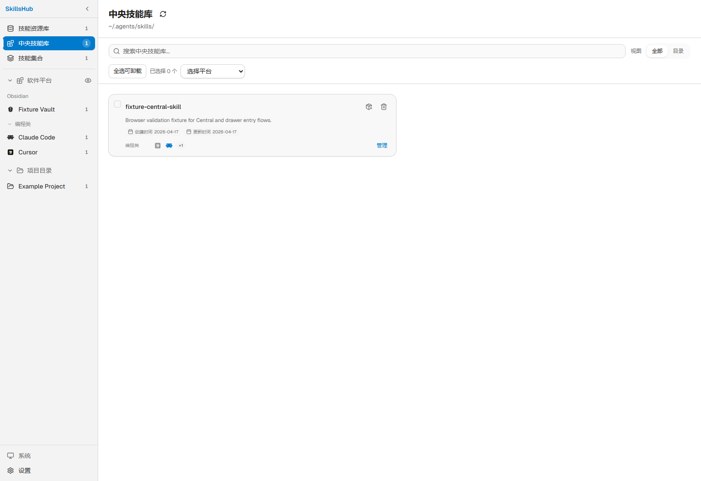
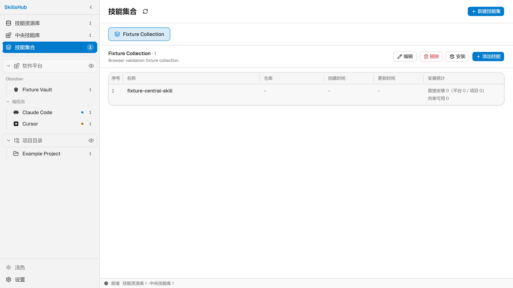
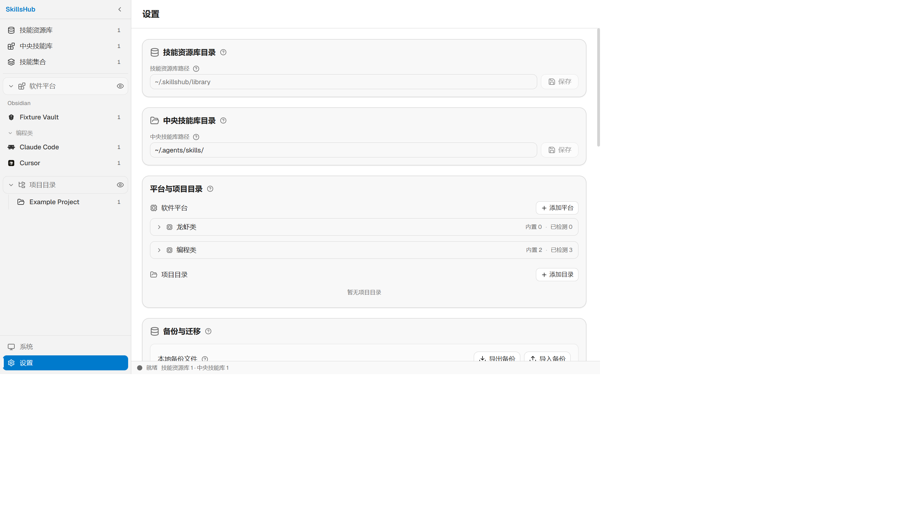

# SkillsHub

本地优先的桌面应用：收集、整理 AI Agent Skills（`SKILL.md`），并安装到多个编程工具与项目目录。

[English](README.md) · [下载 Releases](https://github.com/yufenglyu/skillshub/releases) · [更新日志](CHANGELOG.zh.md)

> **免责声明**  
> SkillsHub 是独立的非官方应用，与 Anthropic、OpenAI、GitHub、skills.sh、MiniMax 或其他受支持平台、发布方、商标所有者均无隶属、背书或赞助关系。

---

## 适合谁用

你在用 Claude Code、Codex、Cursor、Gemini CLI、OpenClaw 等工具，手里有一堆技能包，却不想：

- 每个工具各拷一份、互相不同步  
- 把「下载囤积」和「真正给工具读」混在同一个目录里  
- 换机器或重装后，安装关系全丢  

SkillsHub 把 **长期存放**、**共享兼容库**、**各工具安装目标** 分开管理。

---

## 核心概念

| 概念 | 做什么 | 默认路径 |
|------|--------|----------|
| **技能仓库** | 导入 / 本地添加的默认家；安装时从此同步 | `~/.skillshub/library` |
| **共享中心** | 你主动「加入」后的共享兼容目录（符号链接指向仓库） | `~/.agents/skills` |
| **软件平台** | 某个工具自己的 skills 目录（符号链接或复制） | 按平台配置 |
| **项目目录** | 命名的项目级安装目标 | `<项目>/.agents/skills` |
| **技能合集** | 把仓库技能组成可复用分组，再批量安装 | 应用数据库 |
| **配置目录** | 数据库、仓库、平台清单与图标 | `~/.skillshub`（或便携包同级 `.skillshub`） |

```text
技能仓库 ──安装──► 所选软件平台 / 项目目录
      │
      └──加入共享中心──► ~/.agents/skills
                              │
                              └── 共享给「共享目录」类平台
```

- 仓库技能可以**不进共享中心**，直接装到指定平台或项目。
- 加入共享中心只建符号链接，不复制一份；从共享中心移除只删链接。
- 若某平台的 skills 路径就是 `~/.agents/skills`，向它安装等价于「加入共享中心」，设置里标为 **共享目录**，其余为 **独立目录**。

---

## 功能一览

- **统一表格**：仓库、共享中心、软件平台、项目目录同一套浏览体验；搜索、排序、平铺 / 目录视图。
- **导入技能**：填写 GitHub `owner/repo`，隔离执行 `npx skills add`，再写入仓库；可只导入仓库中某一个技能。
- **添加技能**：复制本机已有的单个或合集技能文件夹。
- **更新技能**：对有来源标记的技能检查更新后再下载；底部状态栏显示进度。
- **安装 / 卸载**：按平台或项目勾选目标；合集可一次分发到多个目标（含可选共享中心）。
- **Discover**：扫描磁盘上的项目技能（侧栏无入口，可通过全局搜索进入）。
- **设置**：路径配置、软件平台启用/编辑、项目目录、本地 ZIP / WebDAV 备份、GitHub PAT、可选 AI 解释、检查更新。
- **中英界面**、本地主题（Catppuccin 风格）。

---

## 界面截图

### 技能仓库



### 共享中心



### 技能合集



### 软件平台


### 设置



---

## 下载与安装

从 [GitHub Releases](https://github.com/yufenglyu/skillshub/releases) 获取对应系统的安装包或便携包：

| 系统 | 常见产物 |
|------|----------|
| Windows | MSI、`skillshub_*_windows_x64.zip` |
| macOS | DMG、`skillshub_*_macos_universal.zip` / `.tar.gz` |
| Linux | deb / rpm、`skillshub-v*_Linux-*.tar.gz` |

安装器或首次启动会准备 `.skillshub`（默认平台清单与图标、空仓库、SQLite）。便携包解压后，应用同级已带 `.skillshub`。从更旧版本升级时，若新目录尚不存在，可从 `~/.skillsmanage` 迁移。

---

## 支持的软件平台

内置平台定义写在配置目录的 `platform/platform.json`，图标在 `platform/icons/`。启动后以该目录为准；旧版「每平台一个 JSON」会自动迁移。可在设置中启用 / 关闭、编辑内置项，或添加自定义平台（kebab-case ID）。

示例：Claude Code、Codex CLI、Cursor、Gemini CLI、GitHub Copilot、OpenClaw、Warp、Windsurf、Trae、Aider、OpenCode、Continue、Qwen 等。侧栏默认只显示**已启用且本机已检测到**的平台。

---

## 备份与隐私

- **本地优先**，不含遥测。  
- 网络仅用于：技能导入 / 更新、GitHub 相关请求、WebDAV、检查更新、可选 AI 解释。  
- 完整备份包含技能仓库、技能合集、平台与安装关系、普通设置；**不含共享中心**，也**不含** API Key / Token / 密码。
- 凭证保存在本机，静态不加密。请勿在 Issue / PR / 日志中泄露真实令牌、私有路径或敏感截图。

---

## 开发

### 环境

- Node.js LTS、pnpm、Rust stable  
- Tauri v2 系统依赖：<https://v2.tauri.app/start/prerequisites/>

### 常用命令

```bash
pnpm install
pnpm tauri dev          # 完整应用（前端热更新，端口 24200）
pnpm test
pnpm typecheck
pnpm lint
cd src-tauri && cargo test
```

### 目录结构

```text
skillshub/
├── src/           # React 前端
├── src-tauri/     # Rust / Tauri 后端
├── images/        # 中文 README 截图
├── images/en/     # 英文 README 截图
├── scripts/       # 打包脚本
├── CHANGELOG.md
└── CHANGELOG.zh.md
```

本地打包：`pnpm package:release:windows|macos|linux`。CI 在推送版本 tag 时发布，说明文字来自 `CHANGELOG.md`。

---

## 许可

[Apache License 2.0](LICENSE)
