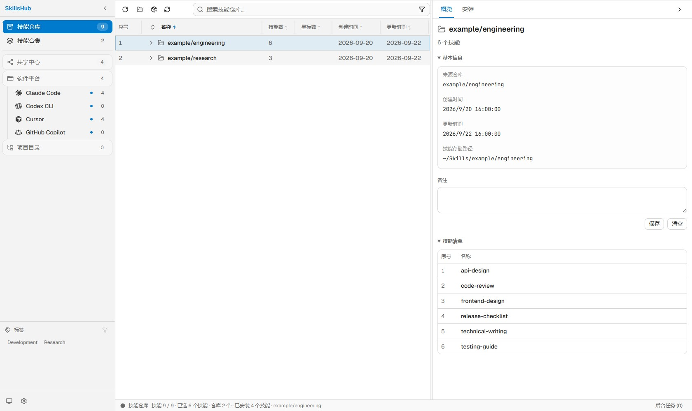
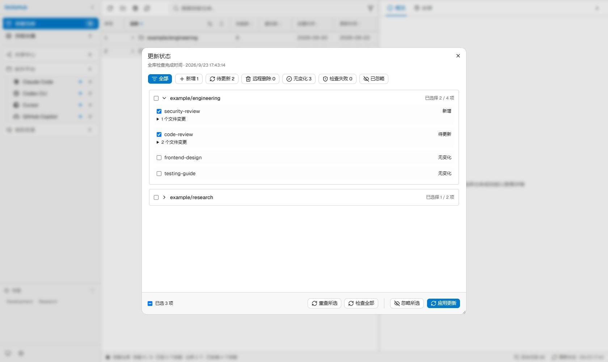
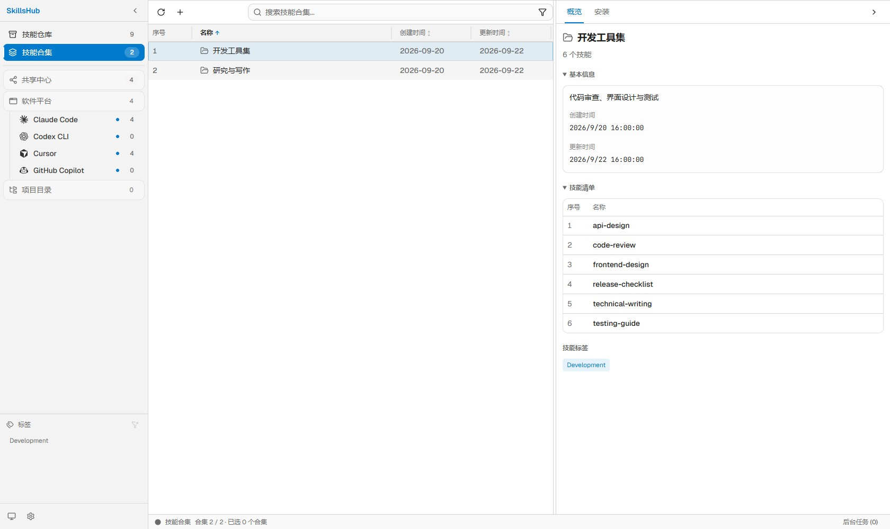
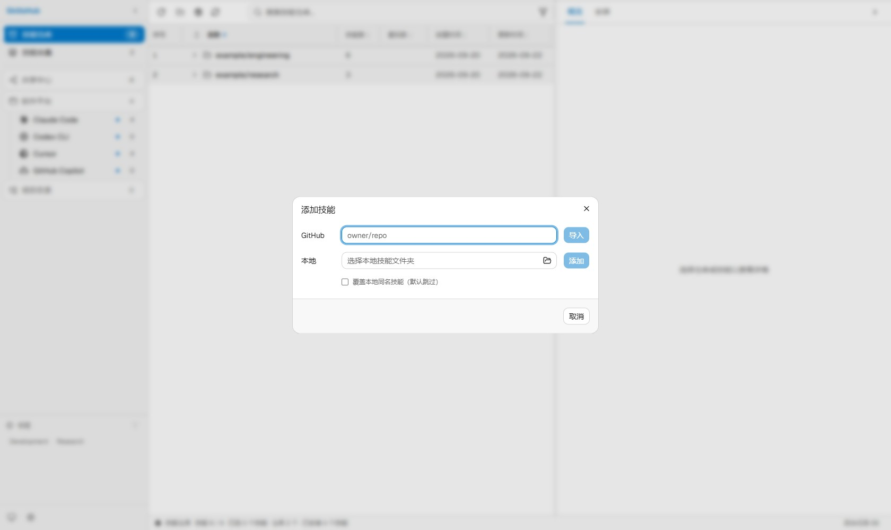

<div align="center">

[简体中文](README_CN.md) · [English](README.md)

# SkillsHub

### 一份技能库，连接你的 AI 工具与项目

集中导入、整理和更新 `SKILL.md` 技能，按需分发给 Claude Code、Codex CLI、Cursor 等工具。

[](https://github.com/yufenglyu/skillshub/releases)
[](LICENSE)


[下载安装](https://github.com/yufenglyu/skillshub/releases) · [快速开始](#快速开始) · [更新日志](CHANGELOG.zh.md) · [反馈问题](https://github.com/yufenglyu/skillshub/issues)

</div>



*截图来自当前 v1.1.0 代码的界面，使用虚构仓库、技能和路径演示；不代表预装内容。*

## 为什么使用 SkillsHub

常用技能散落在不同工具的目录里，换一个项目就要重新复制；收藏的仓库越来越多，却很难记住技能的用途、安装位置和更新情况。SkillsHub 把这些工作集中到一个桌面应用中。

| 你要做的事 | SkillsHub 提供的方式 |
| --- | --- |
| 让多个 AI 工具使用同一套技能 | 仓库集中保存，按平台或项目安装；常用技能可加入共享中心。 |
| 跟进上游变化，又保留选择权 | 更新技能按仓库汇总新增、修改和远程删除，先看文件变更，再应用所选项。 |
| 从大量技能中找到合适的工具 | 标签交集筛选，按名称、描述、备注搜索；拖拽即可批量增删标签。 |
| 为不同工作准备技能组合 | 将技能组织成开发、研究、写作等合集，批量安装到目标。 |
| 理解技能并留下自己的判断 | 阅读文档，手写备注，或让 AI 生成备注与标签建议，修改后再保存。 |
| 在设备间保留自己的技能资产 | 本地文件存储、ZIP 备份、WebDAV 仓库同步与便携模式。 |

## 一次收集，多处使用

**技能仓库是主存储，安装目标按需选择。** 从 GitHub 或本地文件夹导入后，可以直接安装到软件平台、指定项目，也可以把常用技能加入共享中心。

```text
GitHub / 本地文件夹
        ↓
     技能仓库 ── 技能合集：按工作场景组合
        ├── 软件平台：工具自己的技能目录
        ├── 项目目录：<项目>/.agents/skills
        └── 共享中心：~/.agents/skills
```

- **共享中心**通过符号链接引用仓库技能，移出时只删除链接，保留仓库原文件。工具能否使用共享目录取决于其自身支持与配置。
- **软件平台**支持自定义名称和技能路径，可从侧栏右键添加、编辑、停用或删除；未检测到目录时自动取消启用，停用项从侧栏隐藏。
- **项目目录**为不同项目保留各自的技能选择，可从侧栏右键管理。
- **安装关系可见**：在仓库查看安装统计，在平台和项目页区分共享中心与独立安装来源。平台安装优先使用链接，必要时回退复制。

## 更新前，看清楚改了什么

更新技能把来源检查和更新操作放在一起：按仓库折叠浏览，按状态筛选，展开查看文件增删改。



- 按技能或整组选择，只应用需要的更新；远程删除默认不选中。
- 忽略针对当前检测版本，上游再次变化后重新提示。
- 底部“重查所选”仅检查勾选项所属仓库；“重试失败项”重查选中的失败仓库，未勾选时重查当前显示的失败仓库。
- 新旧技能替换在“远程删除”中选择对应项，使用“删除并重新导入”；无法确定对应关系时需手动配对。
- 弹窗可调整大小，切换筛选不会改变高度。
- 导入、检查更新、应用更新和 AI 生成进入后台任务队列，可查看进度、结果并重试失败任务。
- 切换页面或关闭弹窗不打断后台任务。任务仅在应用运行时执行，重启后中断任务可手动重试。

## 整理成自己的技能工具箱

**标签适合查找，合集适合复用。** 给技能添加用途标签，将经常一起使用的技能放进合集，新项目即可批量安装。



- 单击标签筛选，再次单击取消；`Ctrl / Cmd` 多选标签，取交集。
- 多选技能拖到标签上即可添加关联；按住 `Shift` 拖拽仅移除目标标签，不影响其他标签。
- 搜索框内的筛选按钮可选择仓库名称、技能名称、描述和备注范围；目录也可以记录备注。
- 右侧预览支持概览、文档和安装信息；表格支持列显隐、排序、拖动列顺序和调整列宽。
- 技能备注和标签使用 **AI / 保存 / 清空**：AI 每次生成可编辑建议，保存后才写入。AI 服务与提示词可自行配置。

## 快速开始

1. 从 [Releases](https://github.com/yufenglyu/skillshub/releases) 下载适合系统的安装包或便携包，启动 SkillsHub。
2. 在设置中检查软件平台的目录，或在侧栏添加自己的平台和项目。
3. 在技能仓库点击 **添加技能**，填写 GitHub `owner/repo`、仓库 URL，或选择本地技能文件夹。
4. 阅读技能内容，按需添加标签、备注或加入合集，再安装到所需平台、项目或共享中心。
5. 后续通过 **更新技能**审阅来源变化，通过 **后台任务**查看执行状态。

工具栏采用纯图标：包裹加号添加技能，双箭头循环图标更新技能，单箭头旋转图标刷新列表；悬停可查看名称。GitHub 导入只对实际目标目录提示覆盖，不同仓库的同 ID 技能独立保存。



## 数据与备份

技能保存在本机，默认仓库为 `~/.skillshub/library`。便携模式将 `.skillshub` 放在可执行文件同级，便于一起携带。

| 方式 | 用途 |
| --- | --- |
| 本地 ZIP 备份 | 按设置中的备份范围导出和恢复数据。 |
| WebDAV 仓库同步 | 传输技能仓库与合集，恢复时沿用本机路径，保留本机设置和安装目标。 |
| 合集导入 / 导出 | 复用技能组合。 |

GitHub 导入与更新、WebDAV 和可选 AI 功能会连接对应服务。使用 AI 生成时，相关技能内容会发送给配置的 AI 服务。配置目录应作为本地私有数据保管；备份会排除 API Key、Token 和密码。

## 下载与开发

发布包以 [Releases 页面](https://github.com/yufenglyu/skillshub/releases) 中实际提供的文件为准。仓库包含 Windows、macOS 和 Linux 打包脚本；Windows 提供 MSI 和便携 ZIP。

开发环境需要 Node.js、pnpm、Rust 与 Tauri v2 对应系统依赖。

```bash
pnpm install
pnpm tauri dev       # 完整桌面应用
pnpm dev             # 浏览器前端预览
pnpm build           # 类型检查与前端构建
pnpm test
pnpm lint
cd src-tauri && cargo test
```

打包入口：`pnpm package:release:windows`、`pnpm package:release:macos`、`pnpm package:release:linux`。供分发的文件输出到 `release-assets/`。

技术栈：**Tauri 2 · Rust · SQLite · React · TypeScript**。界面支持简体中文、English、明暗主题与强调色配置。

## 参与与许可

欢迎提交问题和改进建议。报告问题时请附上版本、系统和复现步骤，并使用不含私人信息的截图。

SkillsHub 是独立的非官方项目，与所支持工具的厂商无隶属或背书关系。

[Apache License 2.0](LICENSE)
