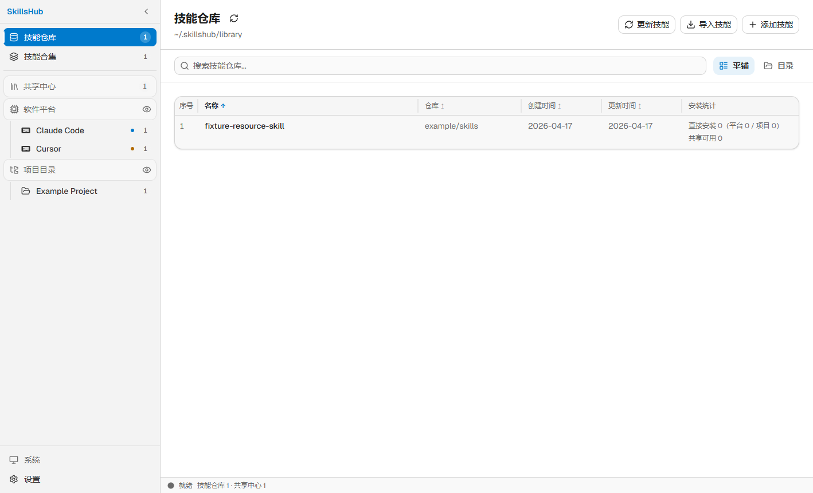
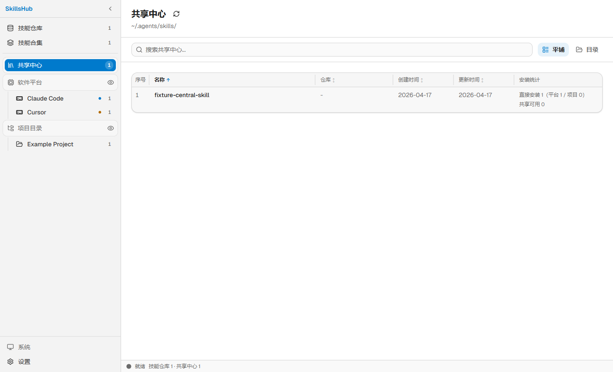
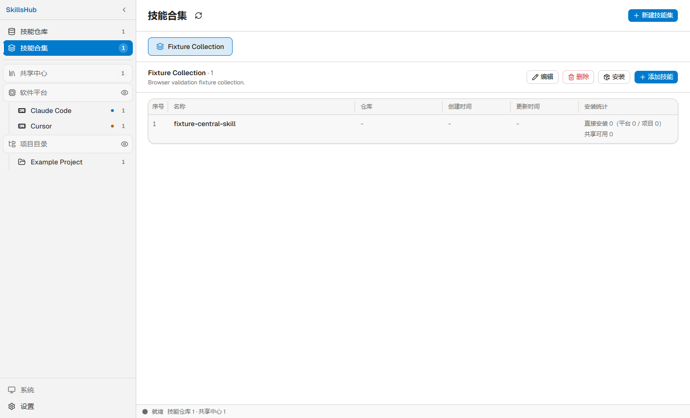
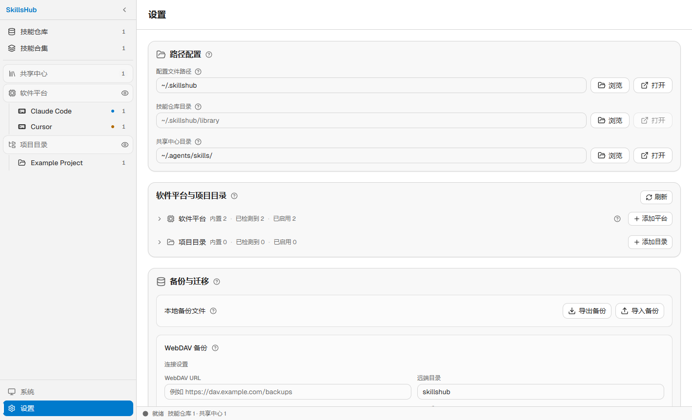
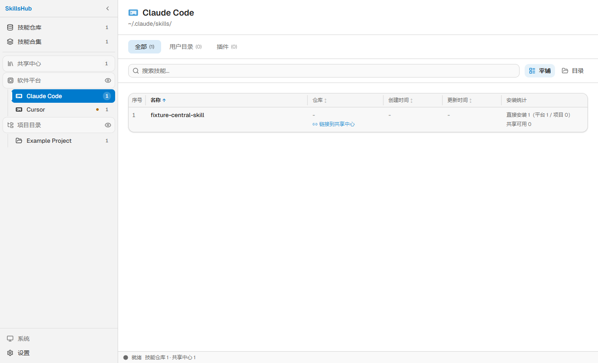

<div align="center">

[简体中文](README_CN.md) | [English](README.md)

# SkillsHub

### 本地优先的 AI Agent Skills 管理桌面应用

收集、更新、分组和安装 `SKILL.md` 技能，让多个编程工具和项目目录共用同一套技能管理流程。


[下载最新版](https://github.com/yufenglyu/skillshub/releases) · [查看功能](#核心能力) · [本地开发](#本地开发) · [更新日志](CHANGELOG.zh.md) · [反馈问题](https://github.com/yufenglyu/skillshub/issues)

**当前文档：简体中文｜应用界面：简体中文 · English**

</div>

> **免责声明**  
> SkillsHub 是独立的非官方应用，与 Anthropic、OpenAI、GitHub、skills.sh、MiniMax 或其他受支持平台、发布方、商标所有者均无隶属、背书或赞助关系。

---

## SkillsHub 是什么？

如果你同时使用 Claude Code、Codex CLI、Cursor、Gemini CLI、GitHub Copilot、Warp、Windsurf、OpenClaw 等工具，SkillsHub 可以作为统一的技能管理入口。

它把三个核心概念分开：

- **技能仓库**：保存导入或本地添加的技能。
- **技能合集**：把仓库技能组织成可重复安装的分组。
- **共享中心**：把选中的仓库技能暴露到 `~/.agents/skills`。

```text
技能仓库 ──安装──► 软件平台 / 项目目录
      │
      └──加入共享中心──► ~/.agents/skills
```

---

## 核心能力

### 导入和维护技能

- 填写 GitHub `owner/repo` 或仓库 URL 导入仓库；SkillsHub 会读取 GitHub 仓库快照，识别其中的 `SKILL.md` 技能并复制到技能仓库。
- 添加本机已有的单个技能文件夹或技能包。
- 对有来源标记的技能检查更新，支持单个技能更新、目录视图按文件夹更新，以及按状态筛选更新统计。

### 安装到多个目标

- 将仓库技能直接安装到已启用的软件平台或命名项目目录。
- 加入共享中心时创建指向仓库的符号链接；移出共享中心时只删除链接，不删除仓库原文件。
- 技能仓库、共享中心、软件平台、项目目录和合集共用一致的平铺 / 目录视图。

### 组织和自动化

- 创建技能合集，并批量安装到多个目标。
- 在设置页配置命令面板、侧边栏展开 / 收起、平铺 / 目录视图切换和页面跳转快捷键。
- 在设置页管理平台定义、项目目录、路径、GitHub PAT、AI 解释、检查更新、本地 ZIP 备份和 WebDAV 备份。

---

## 核心概念

| 概念 | 用途 | 默认位置 |
|------|------|----------|
| **技能仓库** | 导入和本地添加技能的主存储 | `~/.skillshub/library` |
| **技能合集** | 可复用的仓库技能分组 | 应用数据库 |
| **共享中心** | 由仓库符号链接支撑的共享兼容目录 | `~/.agents/skills` |
| **软件平台** | 各工具自己的技能目录 | 按平台配置 |
| **项目目录** | 命名的项目级安装目标 | `<项目>/.agents/skills` |
| **配置目录** | 数据库、仓库、平台清单和设置 | `~/.skillshub` 或便携版 `.skillshub` |

如果某个平台的 skills 路径解析为 `~/.agents/skills`，向该平台安装等价于加入共享中心；其他平台使用自己的独立目录。

---

## 界面截图

### 技能仓库



### 共享中心



### 技能合集



### 设置



### 软件平台与项目目录



---

## 下载与安装

从 [GitHub Releases](https://github.com/yufenglyu/skillshub/releases) 下载安装包或便携包。

| 系统 | 常见产物 |
|------|----------|
| Windows | MSI、`skillshub_*_windows_x64.zip` |
| macOS | DMG、`skillshub_*_macos_universal.zip`、`.tar.gz` |
| Linux | deb、rpm、`skillshub-v*_Linux-*.tar.gz` |

安装器或首次启动会创建 `.skillshub`，其中包含平台定义、空技能仓库和 SQLite。便携包会把 `.skillshub` 放在可执行文件同级。

---

## 本地开发

### 环境要求

- Node.js LTS
- pnpm
- Rust stable
- Tauri v2 系统依赖：<https://v2.tauri.app/start/prerequisites/>

### 常用命令

```bash
pnpm install
pnpm tauri dev
pnpm test
pnpm typecheck
pnpm lint
cd src-tauri && cargo test
```

### 项目结构

```text
skillshub/
├── src/           # React 前端
├── src-tauri/     # Rust / Tauri 后端
├── images/        # 中文 README 截图
├── images/en/     # 英文 README 截图
├── scripts/       # 打包脚本
├── CHANGELOG.md
└── CHANGELOG.zh.md
```

本地打包命令：

```bash
pnpm package:release:windows
pnpm package:release:macos
pnpm package:release:linux
```

---

## 技术栈

- React 18、TypeScript、React Router、Zustand
- Tailwind CSS 4 和 shadcn/ui 风格组件
- Tauri v2、Rust、SQLite、SQLx
- GitHub API、WebDAV、可选 AI 解释服务

---

## 数据与隐私

- 本地优先，不含遥测。
- 网络请求仅用于技能导入 / 更新、GitHub 请求、WebDAV、检查更新和可选 AI 解释。
- 完整备份包含技能仓库、技能合集、平台 / 项目安装关系和普通设置。
- 备份不包含共享中心链接，也不包含 API Key、Token 和密码。
- 凭证静态保存在本机磁盘上，未加密。

---

## 参与贡献

欢迎提交问题报告和聚焦的 Pull Request。请勿在公开 Issue、PR 或日志中包含私有路径、真实令牌、未公开技能或敏感截图。

---

## 许可

[Apache License 2.0](LICENSE)
