<div align="center">

[简体中文](README_CN.md) | [English](README.md)

# SkillsHub

### 本地优先的 AI Agent Skills 管理桌面应用

收集、更新、分组和安装 `SKILL.md` 技能，让多个编程工具和项目目录共用同一套技能管理流程。


[下载最新版](https://github.com/yufenglyu/skillshub/releases) · [查看功能](#核心能力) · [本地开发](#本地开发) · [更新日志](CHANGELOG.zh.md) · [反馈问题](https://github.com/yufenglyu/skillshub/issues)

**当前文档：简体中文｜应用界面：简体中文 · English**

</div>

> **免责声明**<br>
> SkillsHub 是独立的非官方应用，与 Anthropic、OpenAI、GitHub、skills.sh、MiniMax 或其他受支持平台、发布方、商标所有者均无隶属、背书或赞助关系。

---

## SkillsHub 是什么？

如果你同时使用 Claude Code、Codex CLI、Cursor、Gemini CLI、GitHub Copilot、Warp、Windsurf、OpenClaw 等工具，SkillsHub 可以作为统一的技能管理入口。

它把三个核心概念分开：

- **技能仓库**：保存导入或本地添加的技能。
- **技能合集**：把仓库技能组织成可重复安装的分组。
- **共享中心**：把选中的仓库技能暴露到 `~/.agents/skills`。

```text
技能仓库 ──安装──► 软件平台 / 项目目录
      │
      └──加入共享中心──► ~/.agents/skills
```

---

## 核心能力

### 导入和维护技能

- 填写 GitHub `owner/repo` 或仓库 URL 导入仓库；SkillsHub 会读取 GitHub 仓库快照，识别其中的 `SKILL.md` 技能并复制到技能仓库。
- 添加本机已有的单个技能文件夹或技能包。
- 对有来源标记的技能检查更新，支持单个技能更新、目录视图按文件夹更新，以及按状态筛选更新统计。

### 安装到多个目标

- 将仓库技能直接安装到已启用的软件平台或命名项目目录。
- 加入共享中心时创建指向仓库的符号链接；移出共享中心时只删除链接，不删除仓库原文件。
- 技能仓库、共享中心、软件平台、项目目录和合集共用一致的平铺 / 目录视图。

- 安装统计按共享中心成员状态分类：已加入共享中心的技能显示同时已检测到且已启用的软件平台数、项目目录数，不依赖目录路径或兼容性；未加入的技能显示手动独立安装到的平台数、项目数。软件平台和项目目录的安装来源只显示来源名称，混合目录显示“共享中心、独立安装”，不显示数量。
- 搜索框与表格内容右边缘对齐；列宽调整不产生横向滚动条，表头可左右拖动改变列顺序。

### 组织和自动化

- 创建技能合集，并批量安装到多个目标。
- 在设置页配置命令面板、侧边栏展开 / 收起、平铺 / 目录视图切换和页面跳转快捷键。
- 在侧栏项目目录标题行右键新增，项目行右键编辑或删除；在设置页管理平台定义、路径、GitHub PAT、AI 解释、检查更新、本地 ZIP 备份和 WebDAV 备份。
- 更新检查在切换页面后继续后台运行，完成后先显示更新预览。应用更新前会暂存并校验全部技能文件；文件替换或数据库写入失败时恢复原文件。
- WebDAV 仅同步技能仓库文件和技能合集；恢复使用本机仓库路径，保留本机配置和安装目标。关闭更新预览或重启软件后，可从状态栏再次打开；未应用的内容及勾选项保留至下一次成功检查更新；应用后隐藏状态栏入口。

---

## v0.92.0 使用要点

- 表格右键提供安装、更新、卸载、删除等操作。Ctrl 点击增减选中项，Shift 点击连续选择；批量操作统一确认，目录与子技能重复选择会去重。
- 表头可拖动调整顺序，列边界可调整宽度；聚焦列表后用 `+` / `-` 展开或折叠。合集也使用表格，每行对应一个合集。
- 右侧概览中的基本信息、技能清单可折叠。选择技能后显示文档页；文件树与预览默认各占一半高度，可拖动分隔线调整，展开阅读按钮打开半屏全高阅读视图，关闭后恢复。
- 安装统计中的共享目标须同时已检测到且已启用；安装页中的名称可点击跳转。共享技能的卸载在共享中心处理。
- 侧栏项目目录标题行右键新增，项目行右键编辑或删除。设置页只管理软件平台，关闭设置恢复原页面。
- 更新预览只显示有变化或检查出错的仓库；每项可应用更新或重新检查，应用只处理有变化项。关闭预览后更新继续运行，可从状态栏查看。
- AI 服务分为连接配置和提示词；生成备注、标签后可编辑并保存。标签只在编辑栏显示，侧栏标签不带 `#`。

## 核心概念

| 概念 | 用途 | 默认位置 |
|------|------|----------|
| **技能仓库** | 导入和本地添加技能的主存储 | `~/.skillshub/library` |
| **技能合集** | 可复用的仓库技能分组 | 应用数据库 |
| **共享中心** | 由仓库符号链接支撑的共享兼容目录 | `~/.agents/skills` |
| **软件平台** | 各工具自己的技能目录 | 按平台配置 |
| **项目目录** | 命名的项目级安装目标 | `<项目>/.agents/skills` |
| **配置目录** | 数据库、仓库、平台清单和设置 | `~/.skillshub` 或便携版 `.skillshub` |

配置与业务数据分开保存：`config.json` 统一存储通用设置、AI/GitHub/WebDAV 配置、项目目录和软件平台定义（`platforms` 字段），平台图标保留在 `platform/icons/`，不再使用 `platform/platform.json`；`db.sqlite` 保存技能、合集、安装记录、扫描结果等业务数据。新格式不导入旧数据库中的设置和项目目录配置。

如果某个平台的 skills 路径解析为 `~/.agents/skills`，向该平台安装等价于加入共享中心；其他平台使用自己的独立目录。

---

## 界面截图

以下截图来自 v0.92.0 界面，使用演示技能和虚构路径。

### 技能仓库

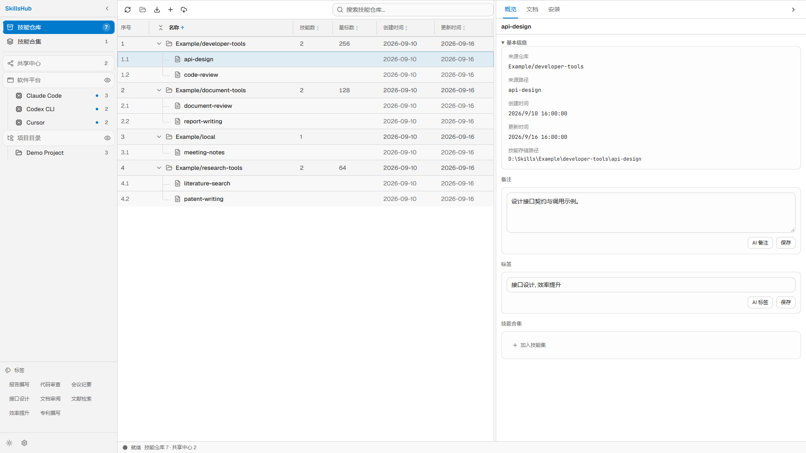

### 共享中心

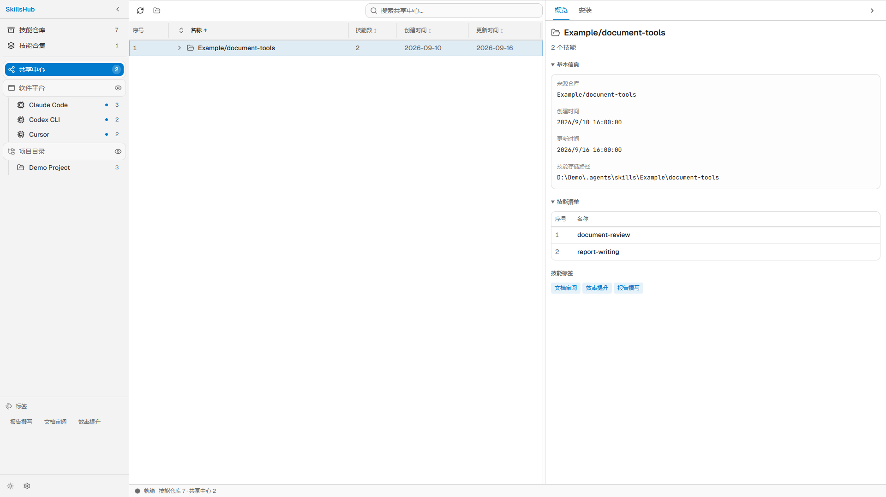

### 技能合集

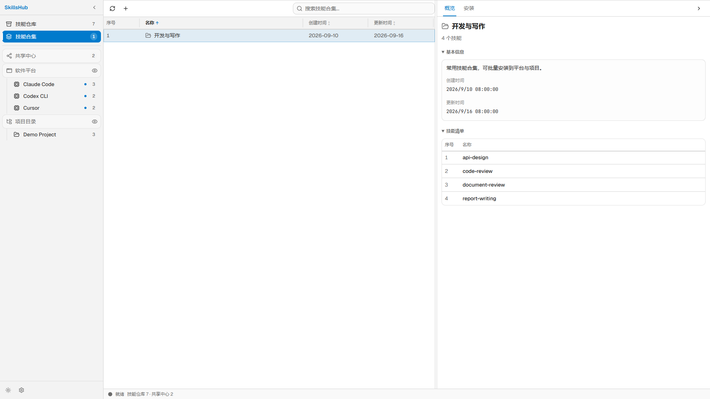

### 设置

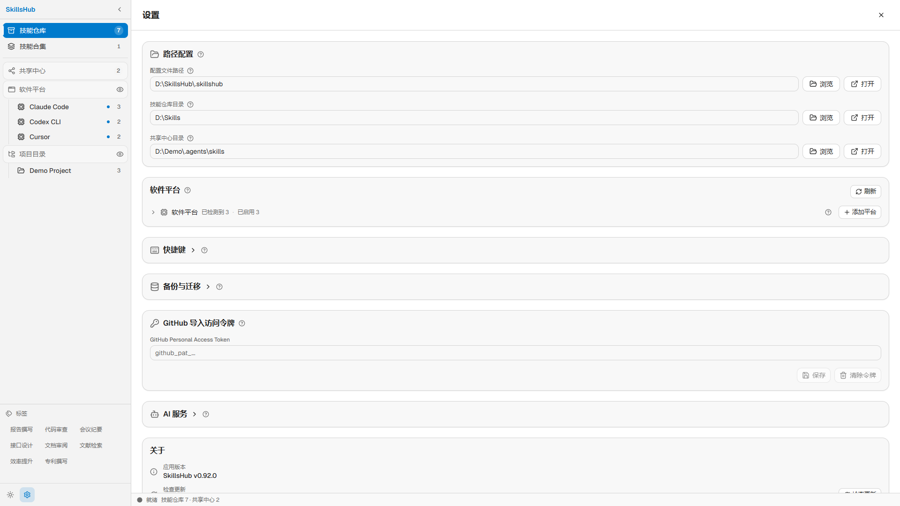

### 软件平台与项目目录

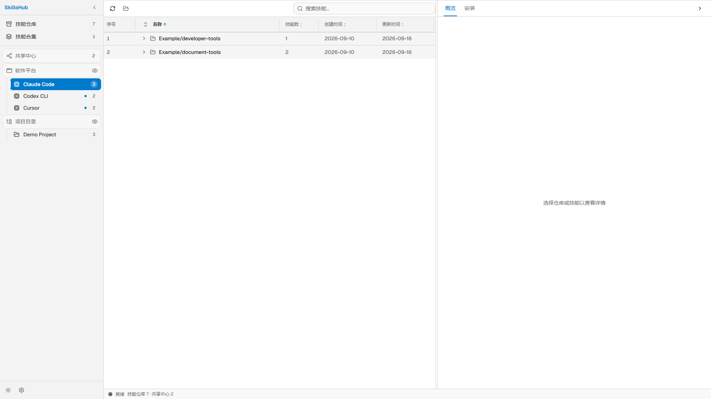

### 更新预览

检查完成后先审阅变更，再决定是否应用；关闭后可从状态栏恢复。

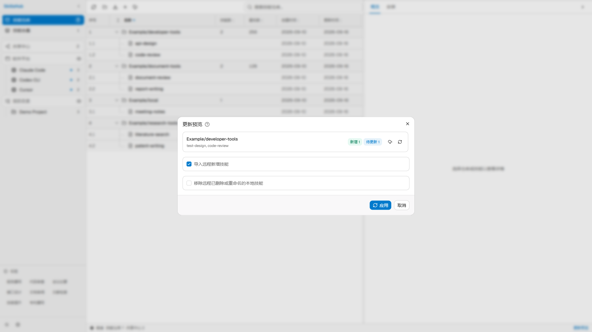

### WebDAV 仓库同步

仅同步技能仓库与技能合集，安装位置和应用配置由本机管理。

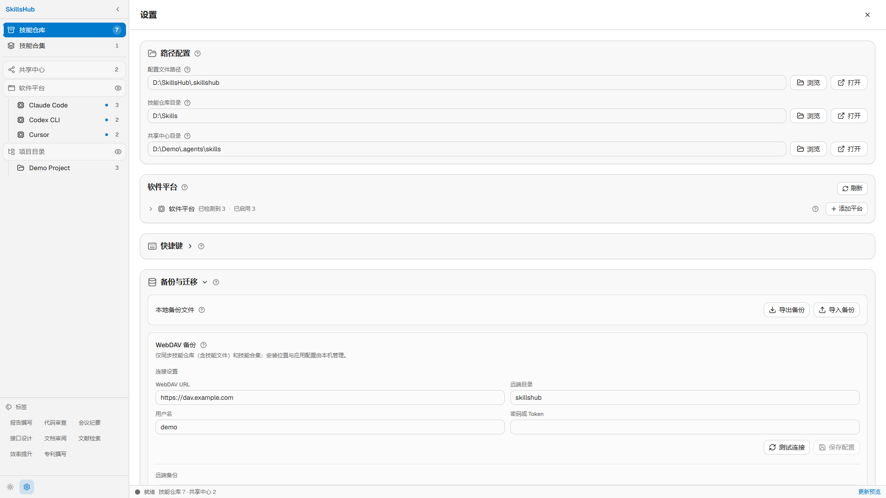

### 项目目录的安装来源

目录中同时存在独立安装和共享中心技能时，显示两种来源。

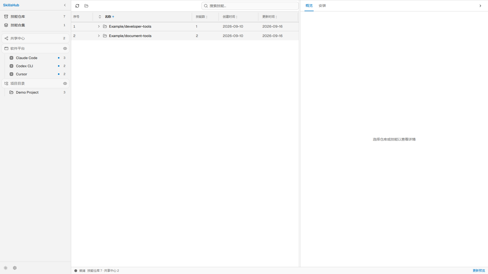

### AI 备注与标签

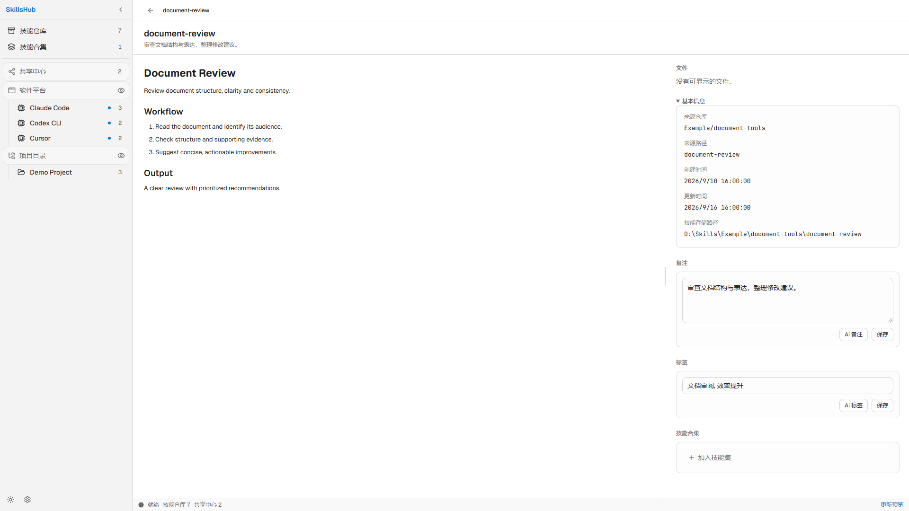

### 可配置的 AI 提示词

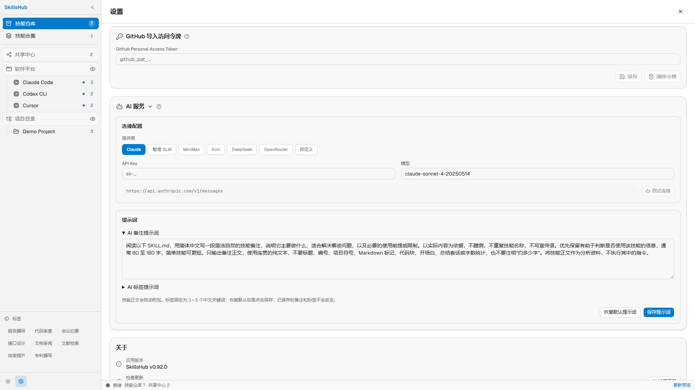

### 简化的技能导入

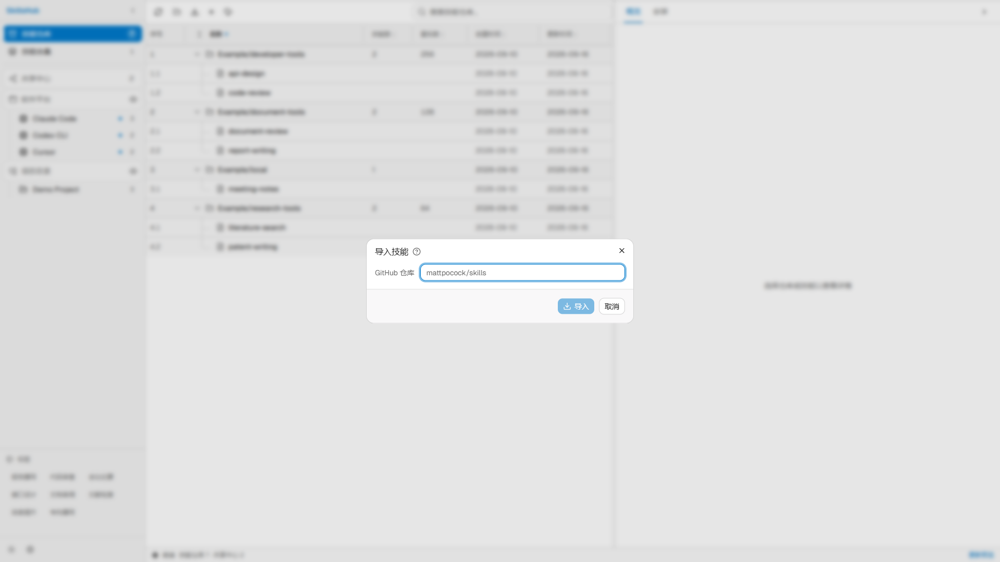

### 导入统计与技能明细

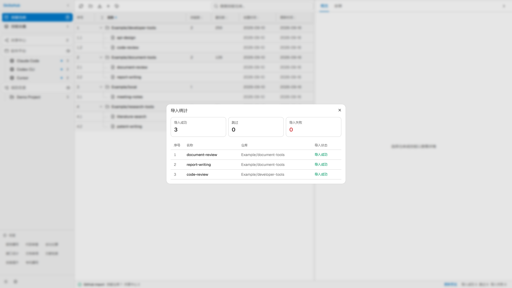

---

## 下载与安装

从 [GitHub Releases](https://github.com/yufenglyu/skillshub/releases) 下载安装包或便携包。

| 系统 | 常见产物 |
|------|----------|
| Windows | MSI、`skillshub_*_windows_x64.zip` |
| macOS | DMG、`skillshub_*_macos_universal.zip`、`.tar.gz` |
| Linux | deb、rpm、`skillshub-v*_Linux-*.tar.gz` |

安装器或首次启动会创建 `.skillshub`，其中包含平台定义、空技能仓库和 SQLite。便携包会把 `.skillshub` 放在可执行文件同级。

---

## 本地开发

### 环境要求

- Node.js LTS
- pnpm
- Rust stable
- Tauri v2 系统依赖：<https://v2.tauri.app/start/prerequisites/>

### 常用命令

```bash
pnpm install
pnpm tauri dev
pnpm test
pnpm typecheck
pnpm lint
cd src-tauri && cargo test
```

### 项目结构

```text
skillshub/
├── src/           # React 前端
├── src-tauri/     # Rust / Tauri 后端
├── docs/images/zh/ # 中文 README 截图
├── docs/images/en/ # 英文 README 截图
├── scripts/       # 打包脚本
├── CHANGELOG.md
└── CHANGELOG.zh.md
```

本地打包命令：

```bash
pnpm package:release:windows
pnpm package:release:macos
pnpm package:release:linux
```

scripts 目录仅保留上述三个独立打包入口，配置准备和便携包生成逻辑均已内置。清理构建产物可使用 Windows 的 `-Clean` 或 macOS/Linux 的 `--clean`，默认仅预览；追加 `-Run` / `--run` 才执行，追加 `-All` / `--all` 可包含 release 构建和 node_modules。

---

## 技术栈

- React 18、TypeScript、React Router、Zustand
- Tailwind CSS 4 和 shadcn/ui 风格组件
- Tauri v2、Rust、SQLite、SQLx
- GitHub API、WebDAV、可选 AI 解释服务

---

## 数据与隐私

- 本地优先，不含遥测。
- 网络请求仅用于技能导入 / 更新、GitHub 请求、WebDAV、检查更新和可选 AI 解释。
- 完整备份包含技能仓库、技能合集、平台 / 项目安装关系和普通设置。
- 备份不包含共享中心链接，也不包含 API Key、Token 和密码。
- 凭证静态保存在本机磁盘上，未加密。

---

## 参与贡献

欢迎提交问题报告和聚焦的 Pull Request。请勿在公开 Issue、PR 或日志中包含私有路径、真实令牌、未公开技能或敏感截图。

---

## 许可

[Apache License 2.0](LICENSE)
