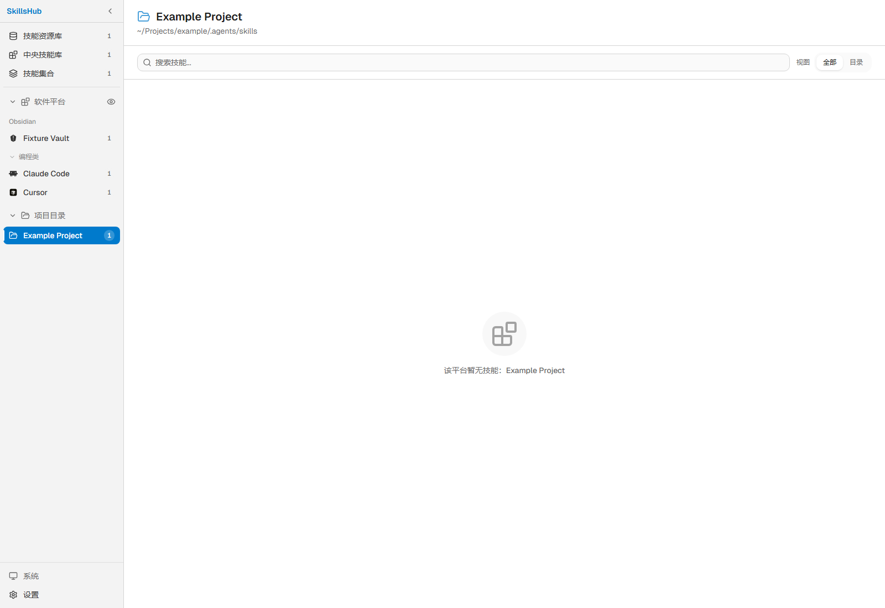

# SkillsHub

SkillsHub 是一个本地优先的桌面应用，用来收集、查看、整理 AI agent skills，并把它们安装到多个 coding 工具和项目目录。

[English](README.md)

> **免责声明**
>
> SkillsHub 是独立的非官方应用。它与 Anthropic、OpenAI、GitHub、skills.sh、MiniMax 或其他受支持平台、发布方、商标所有者均无隶属、背书或赞助关系。

## 它解决什么问题

SkillsHub 把技能的长期保存，和工具真正读取技能的位置分开：

| 区域 | 作用 | 常见路径 |
|------|------|----------|
| **技能资源库** | 导入和本地添加技能的默认入口 | `~/.skillshub/library` |
| **中央技能库** | 你明确选择共享的兼容目录 | `~/.agents/skills` |
| **软件平台** | 某个工具自己的安装目标（符号链接或复制） | 取决于平台 |
| **项目目录** | 可命名的项目级安装目标 | `<项目>/.agents/skills` |
| **技能集合** | 把资源库技能组成可复用分组 | 应用数据库 |

应用数据保存在 `.skillshub` 文件夹中（默认 `~/.skillshub`）。把 `.skillshub` 放到 `skillshub.exe` 同级即可便携使用，也可以在设置里指定其他配置目录。从旧版本升级时，如果新目录还不存在，首次启动会迁移已有的 `~/.skillsmanage`。

## 核心能力

- **统一表格浏览**：技能资源库、中央技能库、软件平台和项目目录都使用同一套表格。搜索、排序和「平铺 / 目录」切换在同一行，视图按钮在搜索框右侧。
- **目录视图**按 `owner/repo` 这类来源路径分组。资源库目录可以加入中央库，或安装到软件平台和项目目录；平台和项目目录可以按目录卸载。
- **安装统计**分成两行：直接安装（平台 / 项目）和共享可用。把鼠标放在单元格上可以看到具体目标名称。
- **操作图标一致**：加入/移出中央技能库、安装/卸载到平台或项目、更新、删除。提示文字保持简短，不带技能名称。
- **导入技能**在隔离目录中执行 `npx skills add owner/repo`，再把完整技能文件夹复制到技能资源库。可选填写技能名称，只导入仓库中的某一个技能。
- **添加技能**复制本地已经准备好的单个 skill 文件夹或合集文件夹，并与可追踪的 npx 导入区分管理。
- **更新技能**先检查来源仓库的更新标记，有变化时才重新下载。底部状态栏显示导入、更新和安装进度。
- 资源库技能可以直接安装到指定软件平台或项目目录，不强制加入中央技能库。
- 加入中央技能库会写入 `~/.agents/skills`。中央库已有托管技能时，新检测到的本地平台和已配置的项目目录会自动纳入同步。
- 如果某个平台或项目的技能目录就是共享的 `.agents/skills`，向它安装会转换为**加入中央技能库**，而不是再做一次自引用安装。已经在中央库中的技能会显示为「已通过中央库共享」。
- 技能集合只保留创建、编辑、删除、批量安装和添加技能。集合页使用单一平铺表格，不再提供目录视图，也不再提供导入/导出技能集。
- 设置页支持配置文件路径（含便携模式）、技能资源库和中央技能库路径、编辑内置平台、添加自定义平台、为项目目录命名、本地 ZIP / WebDAV 备份，以及检查更新。备份不会包含 API Key、Token 或密码类内容。

## 界面截图

中文 README 使用中文界面截图；英文 README 使用英文界面截图。

### 技能资源库


### 中央技能库


### 技能集合


### 设置、软件平台与备份


### 平台技能


### 项目目录



## 安装关系

```text
技能资源库 ── 安装 ──► 所选软件平台 / 项目目录
     │
     └── 加入中央技能库 ──► ~/.agents/skills
                              │
                              └── 同步到已检测平台
                                  和已配置项目
```

- 从技能资源库直接安装时，只写入你勾选的目标。
- 加入中央技能库会写入中央目录。共享根平台（技能目录解析后等于 `~/.agents/skills`）不会再复制一份，而是通过中央库共享。
- 技能集合只保存引用。添加技能时从资源库选择；安装集合或集合中的单个技能时，以资源库技能为来源分发到所选目标。
- 修改资源库、中央库、平台或项目路径不会自动改写已有软链接或副本。移动目录后需要按需重新安装。

## 支持的平台

内置平台可以在设置页编辑或删除。修改会写入本地配置，下次启动后仍然保留。

| 分类 | 示例 |
|------|------|
| 编程类 | Claude Code、Codex CLI、Cursor、Gemini CLI、GitHub Copilot、Kiro CLI、Warp、Windsurf、Trae、Aider、OpenCode、Continue、Qwen 等 |
| 龙虾类 | OpenClaw、AutoClaw、EasyClaw、QClaw、WorkBuddy 等 |
| 自定义 | 任意拥有稳定 skills 目录的本地平台 |

左侧栏默认只展示本机已存在对应 skills 目录的内置平台；也可以手动切换为显示全部平台。龙虾类、编程类下的平台清单与项目目录一样带缩进。软件平台分组和项目目录列表都可以独立折叠。已配置的项目目录不会被当成自定义编程平台。

## 导入和添加技能

- **导入技能**：只填写 GitHub `owner/repo`。SkillsHub 会在隔离临时目录中执行 `npx skills add owner/repo`，然后把下载到的完整技能文件夹复制到技能资源库。
- **添加技能**：选择本地已经准备好的 skill 文件夹。它可以是单个技能目录，也可以是包含多个技能的合集目录。

通过 `npx skills` 导入的技能会保存来源仓库、可选技能名和来源更新标记，用于后续「更新技能」。本地添加的技能没有远程来源，不会参与来源更新。标签、备注和来源信息在重新扫描、导入、刷新和检查更新后都会保留。

## 备份与隐私

SkillsHub 支持导出和导入完整本地备份。本地导出会打开系统保存对话框，直接把 ZIP 写到所选路径。WebDAV 备份支持测试连接、查看远端列表、上传、选择恢复和删除选中备份。远端备份时间按系统时区显示。

备份包含技能文件、来源信息、技能集合、自定义平台、普通应用配置和安装状态。API Key、Token 和密码类内容会被排除，恢复后需要重新填写。

- SkillsHub 本地优先，不包含遥测。
- 只有在使用 `npx skills` 导入或更新、WebDAV 备份、检查更新或 AI 备注时才会发起网络请求。
- 你选择保存的凭据会留在本机，应用不会对本地设置做静态加密。
- 不要在 issue、PR、截图或日志中公开真实 Token、API Key、私有路径或其他敏感信息。

## 开发

### 环境要求

- Node.js LTS
- pnpm
- Rust stable toolchain
- Tauri v2 系统依赖：<https://v2.tauri.app/start/prerequisites/>

### 常用命令

```bash
pnpm install
pnpm tauri dev
pnpm build
pnpm test
pnpm typecheck
pnpm lint
cd src-tauri && cargo test
cd src-tauri && cargo clippy -- -D warnings
```

Vite 开发服务器默认使用 `24200` 端口。

## 发布

推送 `v0.40.0` 这样的版本 tag 后，GitHub Actions 会构建并发布桌面安装包。发布工作流会从 `CHANGELOG.md` 读取对应版本的 release notes，因此每次发布都必须有匹配的更新日志条目。

本地仍可使用分平台脚本打包：

| 平台 | 命令 |
|------|------|
| Windows | `pnpm package:release:windows -- -Version 0.40.0` |
| macOS | `pnpm package:release:macos -- -Version 0.40.0` |
| Linux | `pnpm package:release:linux -- -Version 0.40.0` |

只需要更新版本元数据时使用 `-VersionOnly`。

### 构建输出目录

| 路径 | 生成者 | 用途 | 是否用于发布 |
|------|--------|------|--------------|
| `dist/` | Vite | 前端构建产物，供 Tauri 打包进桌面应用 | 否 |
| `src-tauri/target/` | Cargo/Tauri | Rust 构建缓存、可执行文件和平台原始 bundle | 否 |
| `release-assets/` | 本地打包脚本和 GitHub Actions | 已重命名整理好的最终安装包和压缩包 | 是 |

本地打包完成后，只从 `release-assets/` 取发布文件。`dist/` 和 `src-tauri/target/` 视为构建内部目录，通常只在排查构建问题时查看。

## 项目结构

```text
skillshub/
├── src/                 # React 前端
├── src-tauri/           # Rust/Tauri 后端
├── dist/                # 生成的 Vite 前端构建产物，供 Tauri 使用
├── src-tauri/target/    # 生成的 Cargo/Tauri 构建输出
├── release-assets/      # 生成的最终发布安装包和压缩包
├── images/              # 中文 README 截图
├── images/en/           # 英文 README 截图
├── scripts/             # 发布打包脚本
├── CHANGELOG.md         # 英文更新日志
└── CHANGELOG.zh.md      # 中文更新日志
```

## 许可证

本项目使用 Apache License 2.0，详见 [LICENSE](LICENSE)。
