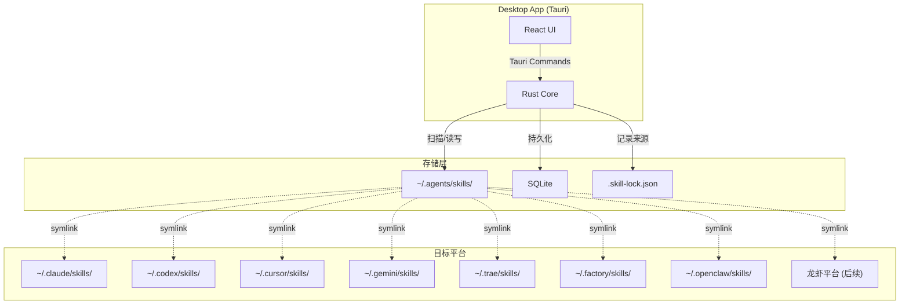
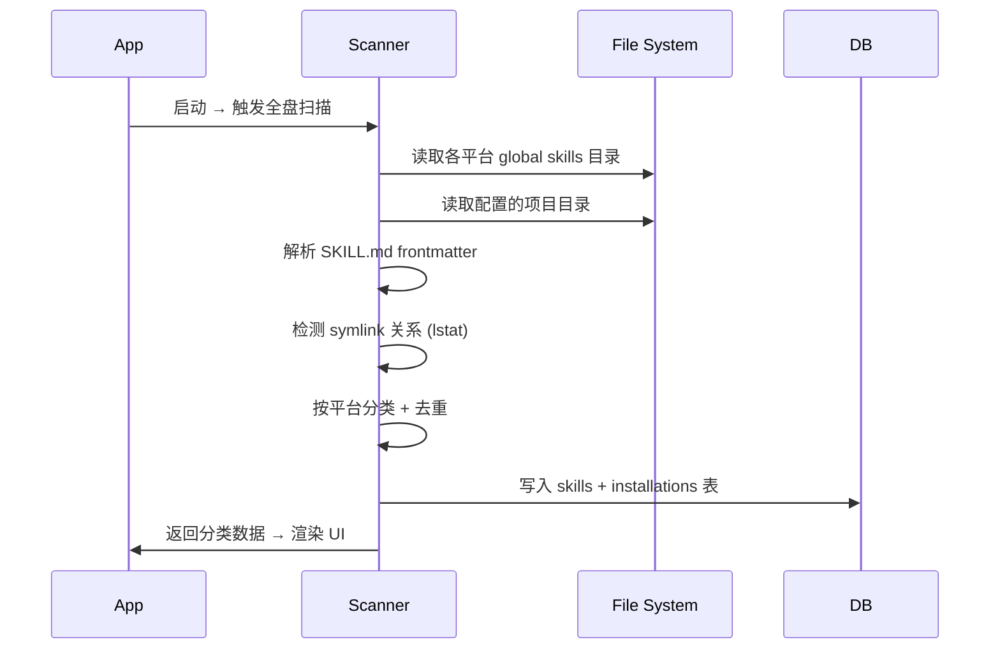

# SkillsHub Desktop 应用设计方案

> 版本：v0.11.1 | 更新日期：2026-07-19

---

## 一、产品定位

**SkillsHub** 是一个跨平台 AI Agent Skills 管理工具，以桌面应用为核心形态。

**核心价值**：
- 一个界面管理所有 AI 工具（Claude Code、Codex、Cursor、Gemini CLI、Trae、Factory Droid、OpenClaw、QClaw 等）的 skills
- 启动即全盘扫描，自动分类整理
- 技能资源库是下载、导入和长期保存的真实源；`~/.agents/skills/` 只保存用户明确加入 Central Skills（中央技能库）的 skills
- 加入中央技能库后自动同步到已启用且已检测到的平台；从资源库直接安装到平台时只写入目标平台，不会进入中央技能库
- 自定义 Collection 支持批量安装 + 导入/导出

**命名约定**：
- `Central Skills`（中央技能库）— 即原 Universal Skills，对应 `~/.agents/skills/` 目录
- 刻意区别于 SkillsGate 的命名，避免品牌混淆

---

## 二、技术栈

| 层 | 技术 | 版本 / 备注 |
|---|------|------------|
| 桌面框架 | **Tauri v2** | Rust backend + WebView，比 Electron 轻 10x |
| 前端框架 | **React 18** + TypeScript | Vite 构建 |
| UI 组件 | **Tailwind CSS 4** + **shadcn/ui** | 现代、轻量、可定制 |
| 状态管理 | **Zustand** | 轻量 + TypeScript 友好 |
| 数据持久化 | **SQLite** (Tauri plugin-sql) | WAL 模式，支持并发 |
| Monorepo | **pnpm workspaces** | 磁盘高效 |

---

## 三、架构设计



<!-- 图例：Canon = ~/.agents/skills/, CC = Claude Code, CX = Codex, CU = Cursor -->
<!-- GE = Gemini CLI, TR = Trae, DR = Factory Droid, OC = OpenClaw, LB = Lobster Platforms -->

### 启动扫描流程



---

## 四、项目结构

```
SkillsHub/
├── src-tauri/                  # Tauri Rust 后端
│   ├── src/
│   │   ├── main.rs             # 入口
│   │   ├── commands/
│   │   │   ├── scanner.rs      # 全盘扫描
│   │   │   ├── linker.rs       # symlink 创建/管理
│   │   │   ├── agents.rs       # 平台注册表 + 检测
│   │   │   ├── collections.rs  # Collection CRUD
│   │   │   └── settings.rs     # 设置管理
│   │   └── db.rs               # SQLite 操作
│   ├── Cargo.toml
│   └── tauri.conf.json
│
├── src/                        # React 前端
│   ├── App.tsx
│   ├── components/
│   │   ├── layout/
│   │   │   ├── Sidebar.tsx
│   │   │   └── MainContent.tsx
│   │   ├── skills/
│   │   │   ├── SkillList.tsx
│   │   │   ├── SkillCard.tsx
│   │   │   ├── SkillDetail.tsx
│   │   │   └── SkillMarkdown.tsx
│   │   ├── platform/
│   │   │   ├── PlatformView.tsx
│   │   │   └── InstallDialog.tsx
│   │   ├── central/
│   │   │   └── CentralSkillsView.tsx
│   │   └── collection/
│   │       ├── CollectionList.tsx
│   │       ├── CollectionView.tsx
│   │       ├── CollectionEditor.tsx
│   │       └── ImportExport.tsx
│   ├── hooks/
│   │   ├── useScanner.ts
│   │   ├── useSkills.ts
│   │   ├── usePlatforms.ts
│   │   └── useCollections.ts
│   ├── stores/
│   │   ├── skillStore.ts
│   │   ├── platformStore.ts
│   │   └── collectionStore.ts
│   ├── lib/
│   │   ├── tauri-commands.ts   # Tauri invoke 封装
│   │   └── skill-parser.ts     # SKILL.md 客户端解析
│   └── types/
│       └── index.ts
│
├── package.json
├── vite.config.ts
├── tailwind.config.ts
├── tsconfig.json
├── docs/
│   ├── research-report.md      # 调研报告
│   └── desktop-design.md       # 本文档
└── reference/
    └── skillsgate/             # 参考项目
```

---

## 五、UI 布局与页面设计

### 整体布局

```
┌─────────────────────────────────────────────────────────┐
│  SkillsHub                                 ─ □ ✕   │
├────────────┬────────────────────────────────────────────┤
│            │                                            │
│  Sidebar   │  Main Content Area                         │
│  (240px)   │                                            │
│            │                                            │
│ ┌────────┐ │  ┌──────────────────────────────────────┐  │
│ │By Tool │ │  │  当前视图内容                        │  │
│ ├────────┤ │  │  （列表 / 详情 / 安装面板）          │  │
│ │Claude  │ │  │                                      │  │
│ │Codex   │ │  │                                      │  │
│ │Cursor  │ │  │                                      │  │
│ │Gemini  │ │  │                                      │  │
│ │Trae    │ │  │                                      │  │
│ │Droid   │ │  │                                      │  │
│ │OClaw   │ │  │                                      │  │
│ │QClaw   │ │  │                                      │  │
│ │...     │ │  │                                      │  │
│ ├────────┤ │  │                                      │  │
│ │Central │ │  │                                      │  │
│ │Skills  │ │  │                                      │  │
│ ├────────┤ │  │                                      │  │
│ │Collec- │ │  │                                      │  │
│ │tions   │ │  │                                      │  │
│ │ ▸ 前端 │ │  │                                      │  │
│ │ ▸ 电商 │ │  │                                      │  │
│ │ ▸ 内容 │ │  │                                      │  │
│ │ + 新建 │ │  │                                      │  │
│ ├────────┤ │  └──────────────────────────────────────┘  │
│ │设置    │ │                                            │
│ └────────┘ │                                            │
└────────────┴────────────────────────────────────────────┘
```

### Sidebar 导航结构

**By Tool（按工具分类）**
- 每个检测到的平台一个入口
- 平台图标 + 名称 + skill 数量角标
- 未检测到的平台显示灰色（可在设置中手动添加路径）

**Central Skills（中央技能库）**
- 对应 `~/.agents/skills/` 目录
- 显示 canonical 真实 skill 总数
- 核心操作：一键安装到指定平台

**Collections**
- 用户创建的自定义分组
- 展开显示每个 Collection 名称
- `+ 新建` 按钮

**设置**
- 配置扫描目录
- 管理自定义平台

---

### 页面 A — 平台视图（By Tool）

```
┌─────────────────────────────────────────────┐
│ 🟣 Claude Code        ~/.claude/skills/     │
│ ─────────────────────────────────────────── │
│ 🔍 搜索 skills...                  ⟳ 刷新  │
│                                             │
│ ┌─────────────────────────────────────────┐ │
│ │ 📄 frontend-design                  [→] │ │
│ │    Build distinctive frontend UIs...    │ │
│ │    🔗 Central Skills ─ symlink          │ │
│ ├─────────────────────────────────────────┤ │
│ │ 📄 code-reviewer                    [→] │ │
│ │    Review code changes and identify...  │ │
│ │    📁 独立安装 ─ copy                  │ │
│ ├─────────────────────────────────────────┤ │
│ │ 📄 deploy                           [→] │ │
│ │    Deploy the application to prod...    │ │
│ │    🔗 Central Skills ─ symlink          │ │
│ └─────────────────────────────────────────┘ │
│                                             │
│ 共 3 个 skills，2 个来自 Central Skills     │
└─────────────────────────────────────────────┘
```

每个 skill 条目：
- 名称（点击进入详情）
- 描述（截断显示）
- 来源标识：左侧来源类型 + 中间短横线连接 + 右侧安装方式，例如 `🔗 Central Skills ─ symlink` 或 `📁 独立安装 ─ copy`
- 右侧 `→` 进入详情

---

### 页面 B — Central Skills 视图

```
┌─────────────────────────────────────────────┐
│ Central Skills          ~/.agents/skills/   │
│ ─────────────────────────────────────────── │
│ 🔍 搜索...        [+ 从 GitHub 安装] [⟳]   │
│                                             │
│ ┌─────────────────────────────────────────┐ │
│ │ 📄 frontend-design                      │ │
│ │    Build distinctive frontend UIs...    │ │
│ │                                         │ │
│ │ 已链接平台:                             │ │
│ │  🟣 Claude  ✓   🟦 Cursor ✓            │ │
│ │  🟠 Codex   ✗   🔵 Gemini ✗            │ │
│ │  🟤 Trae    ✗   🏭 Droid  ✗            │ │
│ │                                         │ │
│ │ [安装到...]  [详情]  [加入集合]         │ │
│ └─────────────────────────────────────────┘ │
└─────────────────────────────────────────────┘

点击 [安装到...] → 弹出安装面板:
┌───────────────────────────────┐
│ 将 frontend-design 安装到:    │
│ ─────────────────────────── │
│ ☑ Claude Code                 │
│ ☑ Cursor                      │
│ ☐ Codex CLI                   │
│ ☐ Gemini CLI                  │
│ ☐ Trae                        │
│ ☐ Factory Droid               │
│ ☐ OpenClaw                    │
│ ☐ QClaw          (待配置)     │
│ ─────────────────────────── │
│ 安装方式: ● Symlink ○ Copy    │
│                               │
│         [取消]  [确认安装]    │
└───────────────────────────────┘
```

安装动作 = 从 `~/.agents/skills/<name>` 创建 skill 级相对路径软链到各平台 global 目录。

---

### 页面 C — Skill 详情页

```
┌─────────────────────────────────────────────┐
│ ← 返回                           [✏️ 编辑]  │
│                                             │
│ 📄 frontend-design                          │
│ Build distinctive frontend UIs...          │
│                                             │
│ ── 基本信息 ──────────────────────────────  │
│ 路径    ~/.agents/skills/frontend-design    │
│ 来源    github:vercel-labs/agent-skills     │
│ 安装时间 2026-04-09                         │
│                                             │
│ ── 安装状态 ──────────────────────────────  │
│ ✅ Claude Code  → ~/.claude/skills/...     │
│ ✅ Cursor       → ~/.cursor/skills/...     │
│ ❌ Codex CLI    [安装]                      │
│ ❌ Gemini CLI   [安装]                      │
│ ❌ Trae         [安装]                      │
│                                             │
│ ── Collections ───────────────────────────  │
│ [🏷 前端开发]  [+ 加入集合]                │
│                                             │
│ ── SKILL.md 预览 ──────────────────────── │
│ [Markdown 渲染] [Raw 源码]                  │
│ ┌─────────────────────────────────────── ┐ │
│ │ # Frontend Design                      │ │
│ │ ## Instructions                        │ │
│ │ Create distinctive, production-grade   │ │
│ │ frontend interfaces...                 │ │
│ └─────────────────────────────────────── ┘ │
└─────────────────────────────────────────────┘
```

---

### 页面 D — Collection 视图

```
┌─────────────────────────────────────────────┐
│ 🏷 前端开发         [编辑名称] [导出] [删除] │
│ 前端开发相关的 skills 集合                  │
│ ─────────────────────────────────────────── │
│                                             │
│ Skills (4):                [+ 添加 Skill]   │
│ ┌─────────────────────────────────────────┐ │
│ │ 📄 frontend-design               [×]   │ │
│ │ 📄 web-design-guidelines         [×]   │ │
│ │ 📄 react-best-practices          [×]   │ │
│ │ 📄 css-architecture              [×]   │ │
│ └─────────────────────────────────────────┘ │
│                                             │
│ [批量安装到...]                             │
│                                             │
│ 点击 [批量安装到...]:                       │
│ 将这 4 个 skills 全部 symlink 到选中平台   │
└─────────────────────────────────────────────┘
```

**Collection 导出格式（JSON）**：
```json
{
  "version": 1,
  "name": "前端开发",
  "description": "前端开发相关的 skills 集合",
  "skills": [
    "frontend-design",
    "web-design-guidelines",
    "react-best-practices",
    "css-architecture"
  ],
  "createdAt": "2026-04-09T00:00:00.000Z",
  "exportedFrom": "SkillsHub"
}
```

---

### 页面 E — 设置页

```
┌─────────────────────────────────────────────┐
│ 设置                                        │
│ ─────────────────────────────────────────── │
│                                             │
│ ── 扫描目录 ──────────────────────────────  │
│ ✅ ~/.agents/skills/      (Central, 内置)   │
│ ✅ ~/.claude/skills/      (内置)            │
│ ✅ ~/.cursor/skills/      (内置)            │
│ ...                                         │
│                                             │
│ 自定义项目目录:                             │
│ ┌─────────────────────────────────────────┐ │
│ │ ~/projects/my-project        [启用] [×] │ │
│ │ ~/work/team-skills           [启用] [×] │ │
│ └─────────────────────────────────────────┘ │
│ [+ 添加项目目录]                            │
│                                             │
│ ── 自定义平台 ────────────────────────────  │
│ ┌─────────────────────────────────────────┐ │
│ │ QClaw    ~/.qclaw/skills/    [编辑] [×] │ │
│ │ EasyClaw ~/.easyclaw/skills/ [编辑] [×] │ │
│ └─────────────────────────────────────────┘ │
│ [+ 添加平台]                                │
│                                             │
│ ── 关于 ──────────────────────────────────  │
│ SkillsHub v0.8.0                        │
│ 数据库: ~/.skillshub/db.sqlite           │
└─────────────────────────────────────────────┘
```

---

## 六、数据模型 (SQLite)

```sql
-- 扫描到的所有 skills
CREATE TABLE skills (
  id          TEXT PRIMARY KEY,     -- skill name (小写连字符)
  name        TEXT NOT NULL,
  description TEXT,
  file_path   TEXT NOT NULL,        -- 实际 SKILL.md 绝对路径
  canonical_path TEXT,              -- ~/.agents/skills/ 下路径(如有)
  is_central  BOOLEAN DEFAULT 0,    -- 是否在 Central Skills 中
  source      TEXT,                 -- github:owner/repo 或 local:/path
  content     TEXT,                 -- SKILL.md 原始内容
  scanned_at  TEXT NOT NULL
);

-- skill 在各平台的安装状态
CREATE TABLE skill_installations (
  skill_id      TEXT NOT NULL,
  agent_id      TEXT NOT NULL,      -- claude-code, cursor, codex, trae, etc.
  installed_path TEXT NOT NULL,     -- 平台目录下的路径
  link_type     TEXT NOT NULL,      -- 'symlink' | 'copy' | 'native'
  symlink_target TEXT,              -- 实际指向的 canonical 路径
  PRIMARY KEY (skill_id, agent_id)
);

-- 平台注册表（内置 + 自定义）
CREATE TABLE agents (
  id                  TEXT PRIMARY KEY,
  display_name        TEXT NOT NULL,
  category            TEXT NOT NULL,     -- 'coding' | 'lobster' | 'other'
  global_skills_dir   TEXT NOT NULL,
  project_skills_dir  TEXT,
  icon_name           TEXT,              -- 用于 UI 图标
  is_detected         BOOLEAN DEFAULT 0, -- 是否检测到已安装
  is_builtin          BOOLEAN DEFAULT 1,
  is_enabled          BOOLEAN DEFAULT 1
);

-- 自定义 Collections
CREATE TABLE collections (
  id          TEXT PRIMARY KEY,          -- UUID
  name        TEXT NOT NULL,
  description TEXT,
  created_at  TEXT NOT NULL,
  updated_at  TEXT NOT NULL
);

CREATE TABLE collection_skills (
  collection_id TEXT NOT NULL,
  skill_id      TEXT NOT NULL,
  added_at      TEXT NOT NULL,
  PRIMARY KEY (collection_id, skill_id)
);

-- 可配置的自定义扫描目录
CREATE TABLE scan_directories (
  id        INTEGER PRIMARY KEY AUTOINCREMENT,
  path      TEXT NOT NULL UNIQUE,
  label     TEXT,
  is_active BOOLEAN DEFAULT 1,
  is_builtin BOOLEAN DEFAULT 0,         -- 内置目录不可删除
  added_at  TEXT NOT NULL
);

-- 全局设置
CREATE TABLE settings (
  key   TEXT PRIMARY KEY,
  value TEXT NOT NULL
);
```

**内置 Agent 注册表数据（初始化）**：

| id | display_name | category | global_skills_dir |
|----|-------------|---------|-------------------|
| claude-code | Claude Code | coding | `~/.claude/skills/` |
| codex | Codex CLI | coding | `~/.codex/skills/`（并只读兼容 `~/.agents/skills/`） |
| cursor | Cursor | coding | `~/.cursor/skills/` |
| gemini-cli | Gemini CLI | coding | `~/.gemini/skills/` |
| trae | Trae | coding | `~/.trae/skills/` |
| factory-droid | Factory Droid | coding | `~/.factory/skills/` |
| openclaw | OpenClaw | lobster | `~/.openclaw/skills/` |
| qclaw | QClaw | lobster | 待确认 |
| easyclaw | EasyClaw | lobster | 待确认 |
| workbuddy | AutoClaw/WorkBuddy | lobster | 待确认 |
| central | Central Skills | central | `~/.agents/skills/` |

---

## 七、Tauri Rust 命令接口

```rust
// === 扫描 ===
#[tauri::command]
async fn scan_all_skills(state: State<AppState>) -> Result<ScanResult>

#[tauri::command]
async fn get_skills_by_agent(agent_id: String) -> Result<Vec<Skill>>

#[tauri::command]
async fn get_central_skills() -> Result<Vec<SkillWithLinks>>

// === 安装/卸载 ===
#[tauri::command]
async fn install_skill_to_agent(skill_id: String, agent_id: String, method: LinkType) -> Result<()>
// method: "symlink" | "copy"
// 如果 method=symlink: 从 ~/.agents/skills/<id> 创建相对路径软链到目标目录

#[tauri::command]
async fn uninstall_skill_from_agent(skill_id: String, agent_id: String) -> Result<()>

#[tauri::command]
async fn batch_install_to_agents(skill_id: String, agent_ids: Vec<String>) -> Result<BatchResult>

// === Skill 详情 ===
#[tauri::command]
async fn get_skill_detail(skill_id: String) -> Result<SkillDetail>

#[tauri::command]
async fn read_skill_content(skill_id: String) -> Result<String>

// === Collections ===
#[tauri::command]
async fn create_collection(name: String, description: Option<String>) -> Result<Collection>

#[tauri::command]
async fn add_skill_to_collection(collection_id: String, skill_id: String) -> Result<()>

#[tauri::command]
async fn remove_skill_from_collection(collection_id: String, skill_id: String) -> Result<()>

#[tauri::command]
async fn batch_install_collection(collection_id: String, agent_ids: Vec<String>) -> Result<BatchResult>

#[tauri::command]
async fn export_collection(collection_id: String) -> Result<String>  // JSON string

#[tauri::command]
async fn import_collection(json: String) -> Result<Collection>

// === 平台管理 ===
#[tauri::command]
async fn detect_agents() -> Result<Vec<AgentWithStatus>>

#[tauri::command]
async fn add_custom_agent(config: CustomAgentConfig) -> Result<Agent>

#[tauri::command]
async fn get_agents() -> Result<Vec<AgentWithStatus>>

// === 设置 ===
#[tauri::command]
async fn add_scan_directory(path: String, label: Option<String>) -> Result<()>

#[tauri::command]
async fn remove_scan_directory(path: String) -> Result<()>

#[tauri::command]
async fn get_scan_directories() -> Result<Vec<ScanDirectory>>

#[tauri::command]
async fn get_setting(key: String) -> Result<Option<String>>

#[tauri::command]
async fn set_setting(key: String, value: String) -> Result<()>
```

---

## 八、软链接机制实现

### 创建 symlink 流程

```
install_skill_to_agent("frontend-design", "claude-code", "symlink")

1. canonical_path = ~/.agents/skills/frontend-design/
2. agent_dir     = ~/.claude/skills/
3. target_path   = ~/.claude/skills/frontend-design

检查:
  - canonical_path 是否存在 SKILL.md ✓
  - target_path 是否已存在:
    - 若是软链接: 询问是否覆盖
    - 若是真实目录: 询问是否覆盖
    - 若不存在: 直接创建

创建:
  relative = ../../.agents/skills/frontend-design
  symlink(relative, ~/.claude/skills/frontend-design)

记录:
  INSERT INTO skill_installations VALUES (
    'frontend-design', 'claude-code',
    '~/.claude/skills/frontend-design',
    'symlink', '~/.agents/skills/frontend-design'
  )
```

### Windows 兼容

- 使用 junction 代替 symlink（无需管理员权限）
- Tauri v2 在 Windows 下自动处理

### Doctor 诊断（可选功能）

扫描时同时检测孤立软链（symlink 指向不存在的 canonical）：
- 显示警告：`⚠️ code-reviewer (Claude Code) - symlink 目标不存在`
- 提供修复选项：重新链接 / 删除孤立链接

---

## 九、实施步骤

### Phase 1 — 项目骨架 + 核心功能（约 2 周）

1. Tauri v2 项目初始化
   - Vite + React + TypeScript 配置
   - Tailwind CSS 4 + shadcn/ui 接入
   - SQLite plugin 配置
2. Rust 后端
   - 平台注册表（硬编码内置平台）
   - SQLite 建表 + 数据初始化
   - 全盘扫描器（读取各平台 global 目录，解析 SKILL.md）
   - symlink 创建/管理器
3. 基础 Tauri Commands 实现
4. 前端骨架
   - Sidebar + 路由
   - 基础状态管理（Zustand）

### Phase 2 — 主要功能页面（约 1.5 周）

5. 平台视图（By Tool）
   - 展示各平台 skills 列表
   - 来源标识（symlink / copy）
6. Central Skills 视图
   - 展示 ~/.agents/skills/ 下的所有 skills
   - 平台链接状态展示
   - [安装到...] 弹窗
7. Skill 详情页
   - Markdown 渲染 + Raw 源码切换
   - 安装状态管理

### Phase 3 — Collections + 设置（约 1 周）

8. Collection 功能
   - 创建/编辑/删除
   - 拖拽添加 skill
   - 批量安装
   - 导入/导出 JSON
9. 设置页
   - 自定义扫描目录
   - 自定义平台注册

### Phase 4 — 打磨 + 龙虾平台（约 1 周）

10. 龙虾平台路径确认后注册（QClaw/EasyClaw/AutoClaw/WorkBuddy）
11. Doctor 诊断功能
12. 应用图标 + 窗口样式
13. 构建打包（macOS .dmg、Windows .exe、Linux .AppImage）

---

## 十、与竞品的差异化

| 维度 | npx skills | SkillsGate | **SkillsHub** |
|------|-----------|------------|------------------|
| 真实源 | `~/.agents/skills/` | `~/.agents/skills/` | `~/.agents/skills/` |
| 软链策略 | Skill 级（有 bug） | Skill 级 | Skill 级 + doctor 诊断 |
| 平台覆盖 | 44+ | 20 | 6编程 + 4龙虾 + 可扩展 |
| 龙虾平台 | 部分 | 无 | 专项支持 |
| 行业分类 | 无 | 无 | 编程/电商/内容/视频 |
| 桌面应用 | 无 | Electron | Tauri（轻 10x） |
| TUI | 无 | Bun | 后续（Ink） |
| Central 概念 | Universal | Universal | Central Skills（独立命名） |
| Collection | 无 | 无 | 有（批量安装+导出） |
| 自定义平台 | 无 | 无 | 支持（龙虾平台动态注册） |
| MCP | 无 | 有 | 后续集成 |
